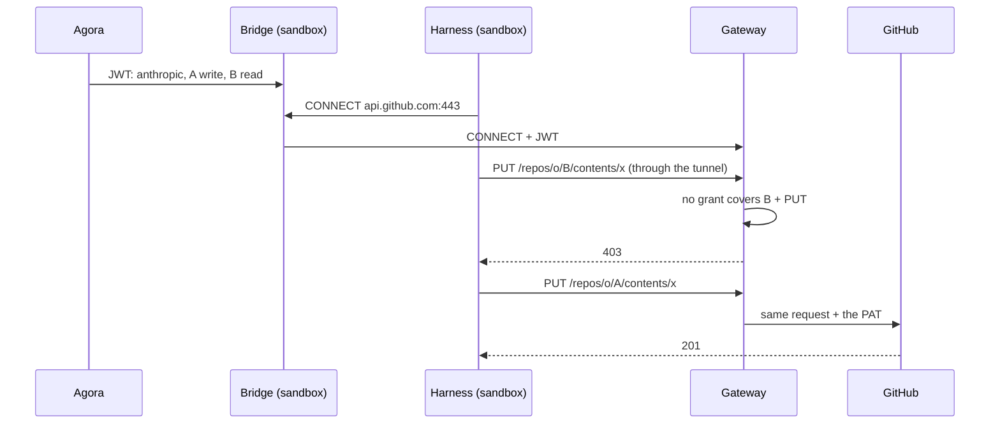

# ADR 000n — Agora's gateway is an execution's only way out

- **Status:** accepted
- **Date:** 2026-09-29

## Context

- A harness runs in a sandbox treated as hostile: any installed tool can run, any file can be
  read. A credential inside can be copied and replayed elsewhere.
- It still needs external services: Anthropic for the model, GitHub for code.
- Rights differ per execution and combine, often on one host: write on repo A and read on
  repo B are both `api.github.com`.
- The sandbox starts in a warm pool, before the execution exists: its environment cannot carry
  a per-execution secret.

## Decision

1. **No credential in the sandbox.** Its only egress is Agora's gateway (agentgateway), reached
   through the bridge's local proxy.
2. **Agora signs the rights.** It compiles the execution's profiles (`anthropic`,
   `github:owner/repo:read|write`) into grants — host, path, methods — and signs them into a
   short-lived JWT, handed to the bridge after the claim.
3. **The gateway decides, then sets the credential.** It verifies the JWT and checks every
   request against the grants with a single rule. If allowed, it sets the host's credential,
   which only it holds (a SOPS-encrypted Kubernetes Secret).
4. **The credential bounds, the grants cut.** One credential per host, as narrow as possible;
   each execution gets only the share its profiles grant.

## Why

- **Any combination fits in one token.** Nothing is created or cleaned up per execution or per
  combination.
- **Secrets live in one place.** Agora never sees them; the sandbox holds a token that expires
  and only works through the gateway, for its grants.
- **One rule, one log.** Each request leaves a line: execution, method, path, status, reason.
- **Secrets change like the rest of the infrastructure.** A SOPS commit; the gateway reloads it
  without a restart.

Measured on g4 under Kata, 2026-09-29: with a PAT able to write to two repos, an execution
granted "write A, read B" created a file on A (201) and was refused the same write on B (403);
Haiku answered through the gateway.

## What we tried

### OneCLI 1.45 (previous implementation)

Stored credentials, injected them, granted each OneCLI *Agent* a selection of secrets; one Agent
per Pod incarnation. Dropped for its identity model (verified live, 2026-09-06):

| Finding | Consequence |
| --- | --- |
| One permanent token per Agent (`aoc_…`), no expiry. | An Agent created and deleted per execution. |
| Creation not idempotent (409), no lookup by identifier. | A lost answer meant listing every Agent. |
| `GET /agents` returns every Agent's token. | Whoever lists can impersonate any Agent. |
| A second secret of the same type broke grant resolution. | Two credentials for one host could not coexist. |

### OneCLI 2.x

v2.0 (2026-08-18) turned OneCLI into a hosted-agent platform — one durable sandbox per agent,
runner, Slack — overlapping Agora and Agent Sandbox. Read in the v2.6.0 code:

| Finding | Consequence |
| --- | --- |
| Still one permanent token per agent; no route takes a lifetime. | No per-execution identity that expires. |
| A grant is a policy rule "one agent, one secret"; agent groups removed. | Composition only on permanent agents, rewriting the workspace policy per grant. |
| Two secrets for one host: order is the database's row order. | The injected credential is not deterministic. |
| Role checks and fine scoping need an enterprise licence. | Not in the open-source edition. |

### Agent Vault 0.39.3 (Infisical)

Built and measured (g4, 2026-09-28): the bridge's proxy to Agent Vault's MITM proxy, one proxy
session per execution; Haiku answered through it. The bridge and the post-claim hand-off were
kept as is. Dropped because it does not compose, and for what it demands of Agora:

| Finding | Consequence |
| --- | --- |
| A session covers a whole vault; services match host and path, not method. | "Write A, read B" cannot be expressed. |
| A request goes through one vault; the path is hidden in TLS from the bridge. | One vault per profile cannot be combined on one host. |
| Minting a session requires `member`, which can also read, set and delete credentials. | Agora would hold every secret it hands out. |
| Per its documentation, the enterprise edition adds method and path filters, still one vault per session. | Same limit, licensed. |

### A short-lived credential per execution

A GitHub App installation token scoped per execution. Dropped: per-execution state and cleanup
in Agora, composition carried by the credential rather than the policy, GitHub only.

### One vault per combination

Dropped outright: vaults grow with the combinations.

### Other gateways (surveyed 2026-09-28)

| Candidate | Why not |
| --- | --- |
| Octelium | Composes natively, but reverse proxy only (base-URL rewrites, awkward for `gh`), AGPL, one maintainer, heavy install. |
| Envoy + OPA | The serious fallback, GraphQL checks included — but building our own gateway. |
| Pomerium, Teleport, StrongDM, Aembit, Keycard, Tailscale Aperture | Reverse proxy, no path and method rules, secret in the Pod, or hosted service. |
| LiteLLM, Kong, Envoy AI Gateway | LLM only: no git, no GitHub. |
| tokenizer (Fly.io) | Elegant model, but refuses `CONNECT`; no release since 2023. |

## Consequences

- The gateway is on the critical path: when it is down, external operations fail, with no
  automatic escalation.
- A new host needs a gateway route and a profile in Agora's catalogue, reviewed as code.
- A JWT cannot be revoked before it expires: keep it short, and Agora reissues it during the
  execution.
- GitHub GraphQL stays closed: the targeted repo cannot be checked there.
- git and codex must trust the gateway's CA by other means than `NODE_EXTRA_CA_CERTS`.
- agentgateway is young and moves fast (1.5 made `iss` and `aud` mandatory): pinned by digest,
  upgraded deliberately, lab cases replayed first.
- Replacing the gateway leaves the bridge's side unchanged: a token handed after the claim,
  joined to each `CONNECT`.
