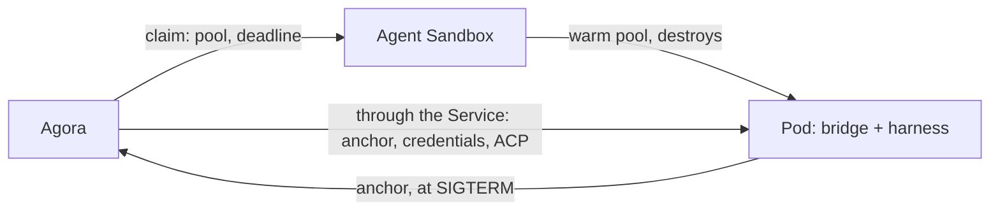

# ADR 000n — Executions

- **Status:** accepted
- **Date:** 2026-09-27

## Context

- Agora needs harnesses (claude-code, codex, …) running in isolated, disposable environments;
  it talks ACP with them and finds the work again after an interruption.
- A harness is hostile: it must hold neither Agora's credentials nor a database login.
- Starting a harness takes seconds; the user should not wait for it.
- Agora does not run infrastructure: no Pod controller, no reaper of its own.

## Decision

1. **Agent Sandbox provides executions.** It is a prerequisite, like Kubernetes: a warm pool per
   harness image, one claim per execution; Kata isolates each Pod in a VM.
2. **A claim carries only a pool and a deadline.** Everything specific to an execution — the
   anchor to restore, the credentials, the ACP session — reaches the sandbox through the bridge,
   after the claim, via the Sandbox's Service. What Agora remembers is in its log.
3. **Agora only sets the deadline**, renewing it during a turn only, and a turn is capped at one
   hour. Stopping is no longer renewing.
4. **Only the infrastructure destroys**, at the deadline.
5. **The Pod saves itself**: at SIGTERM it pushes the harness's native files — the anchor — to
   Agora, proving its identity with its projected ServiceAccount token.

## Why

- **One actor destroys.** No race between Agora and the infrastructure; Agora needs no `delete`
  permission.
- **A warm pool hides the start.** Ready in 0.29 s from the pool, 3.8 to 5.4 s cold.
- **Every sandbox of a pool is interchangeable.** Since nothing specific to an execution goes
  through the claim, any warm sandbox fits any claim of its pool.
- **The Pod knows when it dies.** Pushing at SIGTERM avoids Agora racing its own WATCH against
  the Pod's death.
- **Agora survives its own restart.** The claims say which executions still exist; the log says
  where each one stands.

Measured on g4 under Kata, 2026-09-27, replayed 2026-09-29: the 22 execution cases of the lab
script pass. What each one proves is recorded in `reliability/executions.md`.

## What we tried

| Option | Why not |
| --- | --- |
| Agora deletes claims or Pods | A single actor destroys: the infrastructure. No reaper, no `delete` permission. |
| A Pod controller or reaper of our own | Agent Sandbox already does it. |
| A persistent volume (PVC) in the sandbox | Against the principle, and a PVC on the claim forces a cold start. |
| Renewing between two turns | The lease granted after the turn is enough; then the infrastructure takes the resource back. |
| Agora pulls the anchor during the grace period | A race between its WATCH and the Pod's death; only the Pod knows when it dies. |
| Saving at every turn | The anchor only matters at the end of the Pod; before that, the live sandbox is the reference. |
| The Pod writes to Agora's database | No database login in an untrusted sandbox. |
| A secret or identity injected through the claim | Forces a cold start and puts a secret in the sandbox. |
| Agora's state in annotations on the claim | Used while Agora had no database; beside the log, every annotation duplicated an entry: two sources for the same facts. |
| Reaching the Pod by its IP | The Service is the native building block; the Pod no longer needs to be reached during its grace period. |
| Network rules by domain name | The Cilium DNS proxy's responses do not reach a Kata VM. |
| Agent Sandbox's upstream router | Agora relays the WebSocket itself. |

## Consequences

- A stop frees the resource at most one lease later.
- A new image is a new pool: its name follows the image's digest.
- If Agora is unreachable during the grace period, the sandbox leaves without an anchor.
- A turn lasts at most one hour.
- Restoring from an anchor opens a new Session and pays for the whole context again.
- Kata constraints: no FQDN network rules (plain DNS and address ranges), and clock sync
  disabled in the guest (`systemd.mask=chrony.service`).
