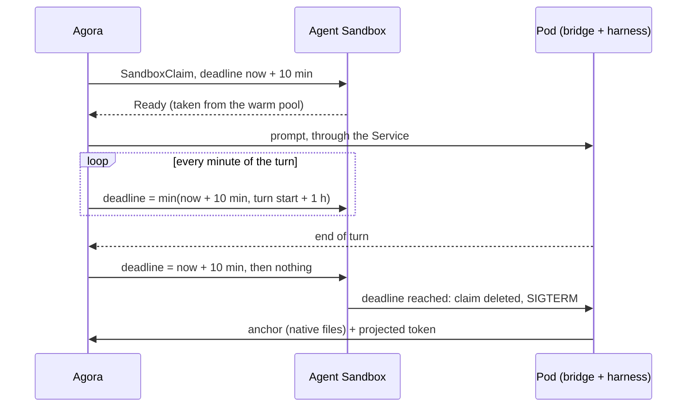

# ADR 000n — Executions

- **Status:** accepted
- **Date:** 2026-09-27

## Context

- Agora runs harnesses (claude-code, codex, …) in isolated, disposable environments, talks ACP
  with them, and finds the work again after an interruption.
- A harness is hostile: it must hold neither Agora's credentials nor a database login.
- Starting a harness takes seconds; the user should not wait for it.
- Agora does not run infrastructure: no Pod controller, no reaper of its own.

## Decision

1. **Agent Sandbox provides executions.** It is a prerequisite, like Kubernetes: one
   `SandboxClaim` per request, taken from a warm pool; Kata isolates each Pod in a VM.
2. **Agora only sets the deadline.** At creation, now + 10 minutes. During a turn, every minute,
   `min(now + 10 min, turn start + 1 h)`. After a confirmed end of turn, one more lease, then
   nothing. Stopping is no longer renewing.
3. **Only the infrastructure destroys**, at the deadline.
4. **The Pod saves itself.** At SIGTERM, the bridge pushes the harness's native files as a
   whole — the anchor — to Agora, identified by its projected ServiceAccount token.
5. **Agora reaches the bridge through the Sandbox's Service**, with an Ed25519 token bound to the
   Pod's name. What Agora must remember about an execution is written on its claim.

## Why

- **One actor destroys.** No race between Agora and the infrastructure; Agora needs no `delete`
  permission.
- **A warm pool hides the start.** Ready in 0.29 s from the pool, 3.8 to 5.4 s cold.
- **The Pod knows when it dies.** Pushing at SIGTERM avoids Agora racing its own WATCH against
  the Pod's death.
- **Agora survives its own restart.** The turn in progress is found again from the claim.

Measured on g4 under Kata, 2026-09-27, replayed 2026-09-29: the 22 execution cases pass.

## What we tried

| Option | Why not |
| --- | --- |
| Agora deletes claims or Pods | A single actor destroys: the infrastructure. No reaper, no `delete` permission. |
| A Pod controller or reaper of our own | Agent Sandbox already does it. |
| A persistent volume (PVC) in the sandbox | Against the principle, and a PVC on the claim forces a cold start. |
| Renewing between two turns | The lease granted after the turn is enough; then the infrastructure takes the resource back. |
| Agora pulls the anchor during the grace period | A race between its WATCH and the Pod's death; only the Pod knows when it dies. |
| Saving at every turn | The anchor only matters at the end of the Pod; before that, the live sandbox is the reference. |
| The Pod writes to Agora's database | No database login in an untrusted sandbox. |
| A secret or identity injected through the claim | Forces a cold start and puts a secret in the sandbox. |
| Reaching the Pod by its IP | The Service is the native building block; the Pod no longer needs to be reached during its grace period. |
| Network rules by domain name | The Cilium DNS proxy's responses do not reach a Kata VM. |
| gVisor | Kata chosen after the 2026-09-22 evaluation. |
| Agent Sandbox's upstream router | Agora relays the WebSocket itself. |

## Consequences

- A stop frees the resource at most one lease later.
- If Agora is unreachable during the grace period, the sandbox leaves without an anchor.
- A turn lasts at most one hour.
- Restoring from an anchor opens a new session and pays for the whole context again.
- Kata constraints: no FQDN network rules (plain DNS and address ranges), and clock sync
  disabled in the guest (`systemd.mask=chrony.service`).
