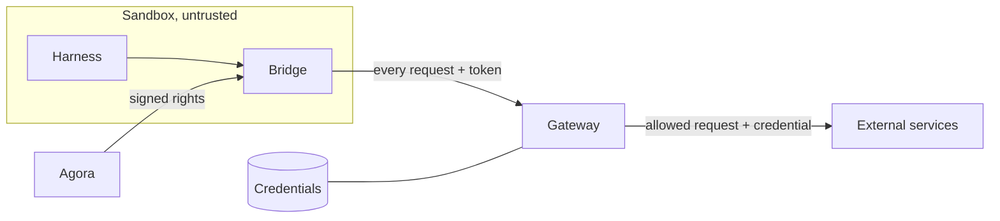

# ADR 000n — Gateway

- **Status:** accepted
- **Date:** 2026-10-02

## Context

- A harness runs in a sandbox treated as hostile: any installed tool can run, any file can be
  read. A credential inside can be copied and replayed elsewhere.
- It still needs external services: Anthropic for the model, GitHub for code.
- Rights differ per execution and combine, often on one host: write on repo A and read on
  repo B are both `api.github.com`.
- The sandbox starts in a warm pool, before the execution exists: its environment cannot carry
  a per-execution secret.
- A harness may need its services before any execution: its SDK initializes against them, and
  stalls without a way out.
- Agora does not run infrastructure: Kubernetes and Agent Sandbox are prerequisites it uses, not
  components it ships.

## Decision

1. **No credential in the sandbox.** Everything it sends out goes through a gateway — a
   prerequisite, like Kubernetes and Agent Sandbox: agentgateway, deployed by the
   infrastructure.
2. **Agora signs rights into short-lived, self-contained tokens**, and does nothing more: it never
   holds a credential. A warm Pod gets its pool's base profiles, the services its harness needs
   before any execution; an execution gets those and its own, before `initialize`.
3. **The gateway checks every request against that token**, then sets the credential it alone
   holds.
4. **The credential bounds, the grants cut.** One credential per host, as narrow as possible;
   each execution gets only the share its token grants.
5. **Agora alone hands tokens to bridges.** Every 5 seconds it looks at the pools' Sandboxes and
   warms the ready ones; it swaps the token at the claim; replacing a token closes the tunnels
   opened with the previous one.

## Why

- **Any combination fits in one token.** Nothing is created or cleaned up per execution or per
  combination.
- **The gateway decides alone.** Everything it needs is in the token: no state to keep in sync,
  no call to Agora per request. Changing an execution's rights is issuing a new token.
- **Secrets live in one place.** Agora never sees them; the sandbox holds a token that expires
  and only works through the gateway, for its grants.
- **One rule, one log.** Each request leaves a line: execution, method, path, status, reason.
- **Warming is the same for every harness.** What differs is declared with the pool — its base
  profiles — not built into Agora or the bridge. A single issuer keeps the order: a late warming
  cannot replace an execution's token, and closing old tunnels makes the new token the only one
  in use.
- **Secrets change like the rest of the infrastructure.** A SOPS commit; the gateway reloads it
  without a restart.
- **agentgateway does all of it natively** (read in its v1.5.0 code, measured on g4): a `CONNECT`
  listener with TLS interception by its own CA, the JWT read from the `CONNECT` headers, one CEL
  rule over the claims and the request's host, path and method, and credentials read from files
  it watches. Apache-2.0, under the Linux Foundation.

Measured on g4 under Kata, 2026-09-29: with a PAT able to write to two repos, an execution
granted "write A, read B" created a file on A (201) and was refused the same write on B (403);
Haiku answered through the gateway. On 2026-09-30, same image: claude-code's first Session
opening took 20,236 ms when the token came after it — its SDK retried against the bridge's
refusals, 14 of them — and 2,518 ms when the token came before `initialize`.

## What we tried

### OneCLI 1.45 (previous implementation)

Stored credentials, injected them, granted each OneCLI *Agent* a selection of secrets; one Agent
per Pod incarnation. Dropped for its identity model (verified live, 2026-09-06):

| Finding | Consequence |
| --- | --- |
| One permanent token per Agent (`aoc_…`), no expiry. | An Agent created and deleted per execution. |
| Creation not idempotent (409), no lookup by identifier. | A lost answer meant listing every Agent. |
| `GET /agents` returns every Agent's token. | Whoever lists can impersonate any Agent. |
| A second secret of the same type broke grant resolution. | Two credentials for one host could not coexist. |

### OneCLI 2.x

v2.0 (2026-08-18) turned OneCLI into a hosted-agent platform — one durable sandbox per agent,
runner, Slack — overlapping Agora and Agent Sandbox. Read in the v2.6.0 code:

| Finding | Consequence |
| --- | --- |
| Still one permanent token per agent; no route takes a lifetime. | No per-execution identity that expires. |
| A grant is a policy rule "one agent, one secret"; agent groups removed. | Composition only on permanent agents, rewriting the workspace policy per grant. |
| Two secrets for one host: order is the database's row order. | The injected credential is not deterministic. |
| Role checks and fine scoping need an enterprise licence. | Not in the open-source edition. |

### Agent Vault 0.39.3 (Infisical)

Built and measured (g4, 2026-09-28): the bridge's proxy to Agent Vault's MITM proxy, one proxy
session per execution; Haiku answered through it. The bridge and the post-claim hand-off were
kept as is. Dropped because it does not compose, and for what it demands of Agora:

| Finding | Consequence |
| --- | --- |
| A session covers a whole vault; services match host and path, not method. | "Write A, read B" cannot be expressed. |
| A request goes through one vault; the path is hidden in TLS from the bridge. | One vault per profile cannot be combined on one host. |
| Minting a session requires `member`, which can also read, set and delete credentials. | Agora would hold every secret it hands out. |
| Per its documentation, the enterprise edition adds method and path filters, still one vault per session. | Same limit, licensed. |

### Other ways for the token to carry the rights

| Option | Why not |
| --- | --- |
| An opaque token the gateway resolves with Agora | State and a lookup per request; Agora on the critical path of every call. It is Agent Vault's session model. |
| An identity per execution, created in the gateway | Created and cleaned up per execution; it is OneCLI's Agent model. |
| Profiles in the token, expanded by the gateway | Moves the profile catalogue into the gateway's configuration. Kept in reserve if tokens grow too big (tens of repos). |

### Warming on Sandbox events

Watching the Sandboxes — a list then a watch, as Agora does for the claims — would hand a warm Pod
its token as soon as it is Ready rather than within 5 seconds, with a timer per Pod for renewal.
Not kept: a second watch to resume (expired versions, reconnections), timers to arm and cancel
through Ready flips, adoptions and deletions, and a periodic resync kept anyway in case an event
is missed. The sweep repairs itself after a restart or a cut, and renews in the same pass.

The 5 seconds cost nothing measured: the execution's token leaves on the claim's event, which the
claims' watch already gives, before `initialize` — that is where the 20 seconds went. A warm token
only matters to a harness initializing in the pool, and none does. Reconsider when one does and
the delay shows in the Session opening, or when the pools grow to where a list every 5 seconds
weighs.

### The Pod asking for its token

The bridge could ask Agora for a warm token at start, authenticated by its projected
ServiceAccount token as for the anchor. Dropped: the bridge would need renewal, and retries while
Agora is away; and a warm token asked just before the claim could arrive after the execution's
and replace it. Closing that race means teaching the bridge which token wins — the order a single
issuer keeps for free.

### A short-lived credential per execution

A GitHub App installation token scoped per execution. Dropped: per-execution state and cleanup
in Agora, composition carried by the credential rather than the policy, GitHub only.

### One vault per combination

Dropped outright: vaults grow with the combinations.

### Other gateways (surveyed 2026-09-28)

| Candidate | Why not |
| --- | --- |
| Octelium | Composes natively, but reverse proxy only (base-URL rewrites, awkward for `gh`), AGPL, one maintainer, heavy install. |
| Envoy + OPA | The serious fallback, GraphQL checks included — but building our own gateway. |
| Pomerium, Teleport, StrongDM, Aembit, Keycard, Tailscale Aperture | Reverse proxy, no path and method rules, secret in the Pod, or hosted service. |
| LiteLLM, Kong, Envoy AI Gateway | LLM only: no git, no GitHub. |
| tokenizer (Fly.io) | Elegant model, but refuses `CONNECT`; no release since 2023. |

## Consequences

- The gateway is on the critical path: when it is down, external operations fail, with no
  automatic escalation.
- A new host needs a gateway route and a profile in Agora's catalogue, reviewed as code.
- A JWT cannot be revoked before it expires: keep it short, and Agora reissues it — in the pool
  while the Pod waits, and between turns during an execution, where closing tunnels interrupts
  nothing.
- A warm Pod can reach its base services before anyone uses it: base profiles are reviewed with
  the pool, cover services only — never a repository — and its token names the Pod.
- A Pod waits up to 5 seconds after being Ready for its warm token: a claim in that window starts
  without one, and still gets the execution's before `initialize`.
- Whether a harness uses the way out to initialize in the pool is its own capability; a warm
  token makes it possible, it does not make it happen.
- The token grows with the grants: a few hundred bytes for a few repos. Tens of repos would call
  for profiles expanded by the gateway instead.
- GitHub GraphQL stays closed: the targeted repo cannot be checked there.
- A credential that rotates — the ChatGPT session codex uses — needs a refresher beside the gateway,
  and a login of its own: its refresh token may be spent once, so nothing else may hold it.
- What is not Node trusts the gateway's CA by other means than `NODE_EXTRA_CA_CERTS`: codex, a Rust
  binary, through `SSL_CERT_FILE`; git is still to settle.
- agentgateway is young and moves fast (1.5 made `iss` and `aud` mandatory): pinned by digest,
  upgraded deliberately, lab cases replayed first.
- Replacing the gateway leaves the bridge's side unchanged: a token handed at runtime, joined to
  each `CONNECT`.
