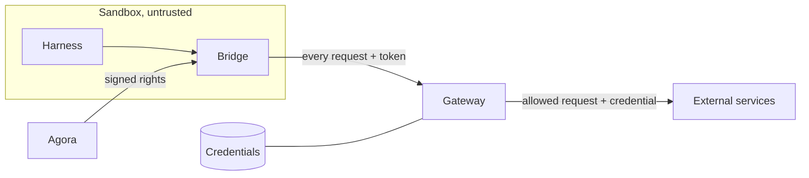

# ADR 000n — Gateway

- **Status:** accepted
- **Date:** 2026-09-30

## Context

- A harness runs in a sandbox treated as hostile: any installed tool can run, any file can be
  read. A credential inside can be copied and replayed elsewhere.
- It still needs external services: Anthropic for the model, GitHub for code.
- Rights differ per execution and combine, often on one host: write on repo A and read on
  repo B are both `api.github.com`.
- The sandbox starts in a warm pool, before the execution exists: its environment cannot carry
  a per-execution secret.
- SDK preinitialization can make outbound requests before a user turn. The harness's base
  service needs are known from its image; resources provisioned for an execution are known
  after assignment and can change later.
- A token is carried by a CONNECT tunnel. Replacing it for future tunnels leaves already-open
  connections with their previous identity, grants and expiry.
- Agora does not run infrastructure: Kubernetes and Agent Sandbox are prerequisites it uses, not
  components it ships.

## Decision

1. **No credential in the sandbox.** Everything it sends out goes through a gateway — a
   prerequisite, like Kubernetes and Agent Sandbox: agentgateway, deployed by the
   infrastructure.
2. **Agora signs rights into short-lived, self-contained tokens.** A warm Pod receives only its
   reviewed harness base profiles. Assignment replaces that identity with the execution and
   adds only rights of provisioned resources bound to it. Agora never holds an upstream credential.
3. **The gateway checks every request against that token**, then sets the credential it alone
   holds.
4. **The credential bounds, the grants cut.** One credential per host, as narrow as possible;
   each execution gets only the share its token grants.
5. **One confirmed configuration per turn.** Changes to grants, model and effort take effect
   between turns. Agora keeps prompt admission closed until the required effects are confirmed.
6. **Token replacement resets outbound tunnels at that boundary.** The SDK process, Session and
   ACP connection continue. Renewal also happens before admission, with enough validity for the
   bounded turn. An uncertain turn does not permit the reset.

## Why

- **Any combination fits in one token.** Nothing is created or cleaned up per execution or per
  combination.
- **The gateway decides alone.** Everything it needs is in the token: no state to keep in sync,
  no call to Agora per request. Changing an execution's rights is issuing a new token.
- **The configuration has one application boundary.** Replacing the token and closing old
  outbound tunnels between turns makes new grants effective on reused hosts without changing
  the gateway's authorization model or restarting the SDK.
- **Secrets live in one place.** Agora never sees them; the sandbox holds a token that expires
  and only works through the gateway, for its grants.
- **One rule, one log.** Each request leaves a line: execution, method, path, status, reason.
- **Secrets change like the rest of the infrastructure.** A SOPS commit; the gateway reloads it
  without a restart.
- **agentgateway does all of it natively** (read in its v1.5.0 code, measured on g4): a `CONNECT`
  listener with TLS interception by its own CA, the JWT read from the `CONNECT` headers, one CEL
  rule over the claims and the request's host, path and method, and credentials read from files
  it watches. Apache-2.0, under the Linux Foundation.

Measured on g4 under Kata, 2026-09-29: with a PAT able to write to two repos, an execution
granted "write A, read B" created a file on A (201) and was refused the same write on B (403);
Haiku answered through the gateway.

Read in the bridge at commit `bcd7643` on 2026-09-30: PUT /credentials replaces the token for
new tunnels while existing pipes retain the token captured at CONNECT. Read in agentgateway
v1.5.0: route JWT validation obtains its token from the configured source; Agora's deployed
routes use the CONNECT headers. This is the reason token replacement needs tunnel reset.

Measured on g4 under Kata on 2026-09-30, same pinned Claude image: direct Session opening took
20,236 ms with credentials supplied after opening and 2,518 ms with credentials supplied before
initialize, with 14 and zero refused outbound connections respectively. A separate SDK startup
probe after claim took 1,400 ms to preinitialize and 0.53 ms to obtain its already-initialized
query, without a prompt. These measurements cover credential ordering and SDK reuse; pool
authorization handoff and reset between turns have their own unmeasured acceptance cases in
the credentials spec.

## What we tried

### OneCLI 1.45 (previous implementation)

Stored credentials, injected them, granted each OneCLI *Agent* a selection of secrets; one Agent
per Pod incarnation. Dropped for its identity model (verified live, 2026-09-06):

| Finding | Consequence |
| --- | --- |
| One permanent token per Agent (`aoc_…`), no expiry. | An Agent created and deleted per execution. |
| Creation not idempotent (409), no lookup by identifier. | A lost answer meant listing every Agent. |
| `GET /agents` returns every Agent's token. | Whoever lists can impersonate any Agent. |
| A second secret of the same type broke grant resolution. | Two credentials for one host could not coexist. |

### OneCLI 2.x

v2.0 (2026-08-18) turned OneCLI into a hosted-agent platform — one durable sandbox per agent,
runner, Slack — overlapping Agora and Agent Sandbox. Read in the v2.6.0 code:

| Finding | Consequence |
| --- | --- |
| Still one permanent token per agent; no route takes a lifetime. | No per-execution identity that expires. |
| A grant is a policy rule "one agent, one secret"; agent groups removed. | Composition only on permanent agents, rewriting the workspace policy per grant. |
| Two secrets for one host: order is the database's row order. | The injected credential is not deterministic. |
| Role checks and fine scoping need an enterprise licence. | Not in the open-source edition. |

### Agent Vault 0.39.3 (Infisical)

Built and measured (g4, 2026-09-28): the bridge's proxy to Agent Vault's MITM proxy, one proxy
session per execution; Haiku answered through it. The bridge and the post-claim hand-off were
kept as is. Dropped because it does not compose, and for what it demands of Agora:

| Finding | Consequence |
| --- | --- |
| A session covers a whole vault; services match host and path, not method. | "Write A, read B" cannot be expressed. |
| A request goes through one vault; the path is hidden in TLS from the bridge. | One vault per profile cannot be combined on one host. |
| Minting a session requires `member`, which can also read, set and delete credentials. | Agora would hold every secret it hands out. |
| Per its documentation, the enterprise edition adds method and path filters, still one vault per session. | Same limit, licensed. |

### Other ways for the token to carry the rights

| Option | Why not |
| --- | --- |
| An opaque token the gateway resolves with Agora | State and a lookup per request; Agora on the critical path of every call. It is Agent Vault's session model. |
| An identity per execution, created in the gateway | Created and cleaned up per execution; it is OneCLI's Agent model. |
| Profiles in the token, expanded by the gateway | Moves the profile catalogue into the gateway's configuration. Kept in reserve if tokens grow too big (tens of repos). |
| A mutable rights lookup at the gateway for every request | Studied for immediate updates on existing tunnels. Changes are applied between turns, where replacing the JWT and resetting connections preserves self-contained authorization. |
| Replace a JWT while leaving old tunnels open | Code read at `bcd7643`: existing connections retain old grants and expiry. It does not establish the next turn's effective configuration. |
| Reset all outbound tunnels during an active turn | Can interrupt a streamed model response or a tool request. Application waits for the confirmed boundary instead. |

### A short-lived credential per execution

A GitHub App installation token scoped per execution. Dropped: per-execution state and cleanup
in Agora, composition carried by the credential rather than the policy, GitHub only.

### One vault per combination

Dropped outright: vaults grow with the combinations.

### Other gateways (surveyed 2026-09-28)

| Candidate | Why not |
| --- | --- |
| Octelium | Composes natively, but reverse proxy only (base-URL rewrites, awkward for `gh`), AGPL, one maintainer, heavy install. |
| Envoy + OPA | The serious fallback, GraphQL checks included — but building our own gateway. |
| Pomerium, Teleport, StrongDM, Aembit, Keycard, Tailscale Aperture | Reverse proxy, no path and method rules, secret in the Pod, or hosted service. |
| LiteLLM, Kong, Envoy AI Gateway | LLM only: no git, no GitHub. |
| tokenizer (Fly.io) | Elegant model, but refuses `CONNECT`; no release since 2023. |

## Consequences

- The gateway is on the critical path: when it is down, external operations fail, with no
  automatic escalation.
- A new host needs a gateway route and a profile in Agora's catalogue, reviewed as code.
- A JWT cannot be revoked before it expires. Closing bridge tunnels makes its replacement
  effective on that execution's future connections, but does not revoke the signed token
  itself. Resource removals also take effect at the next confirmed boundary; an urgent halt
  uses Stop rather than an ordinary configuration change.
- Agora coordinates the warmup-to-execution handoff, records requested and applied settings,
  and renews tokens before admitting turns. Token lifetime must cover the maximum admitted
  turn plus a margin; it cannot simply follow the shorter, renewable sandbox lease.
- A failed or interrupted application blocks the next prompt. Recovery establishes the applied
  state; it does not assume that a missing acknowledgement means no effect.
- A final ACP response does not prove that detached tasks are idle. Reset behavior for those
  tasks is part of each harness's conformance requirements.
- The token grows with the grants: a few hundred bytes for a few repos. Tens of repos would call
  for profiles expanded by the gateway instead.
- GitHub GraphQL stays closed: the targeted repo cannot be checked there.
- git and codex must trust the gateway's CA by other means than `NODE_EXTRA_CA_CERTS`.
- agentgateway is young and moves fast (1.5 made `iss` and `aud` mandatory): pinned by digest,
  upgraded deliberately, lab cases replayed first.
- The bridge receives tokens at runtime and joins them to each CONNECT. The warmup issuer and
  execution driver must agree on ownership so an old warmup update cannot replace execution
  rights. The between-turn reset and its acknowledgements are acceptance requirements; the
  credentials spec records their validation separately from the measured gateway chain.
