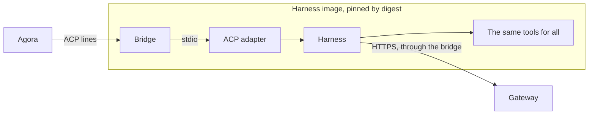

# ADR 000n — Harnesses

- **Status:** accepted
- **Date:** 2026-10-02

## Context

- Agora works with several harnesses — claude-code, codex, … — without depending on their CLIs,
  transcripts or file formats.
- It needs structured exchanges: prompts, streamed content, tool calls, plans, permissions,
  cancellation, configuration.
- A harness runs in a hostile sandbox, started in a warm pool before any execution exists.
- Whatever sits in the sandbox can be read, run or subverted by the agent.
- Harnesses keep their state differently: claude-code reads its session files when a session is
  resumed; opencode opens a database when it starts.

## Decision

1. **ACP is the only protocol between Agora and a harness.** Each harness comes with its ACP
   adapter; Agora speaks ACP unchanged, with no protocol of its own on top.
2. **One image per harness:** the harness, its adapter, the bridge and the same tools for all,
   pinned by digest. No variant per right, persona or profile: rights are grants at the gateway.
3. **The image is trusted, the execution is not.** Nothing is installed at start, and nothing in
   the sandbox is relied on for security.
4. **The bridge is thin.** It starts the adapter and reports ready while it runs, checks Agora's
   token, pipes ACP lines between the adapter and a single connection, gives the adapter its only
   way out, and puts back or pushes the anchor — restarting, before any line, an adapter that
   holds its files open. It numbers nothing, keeps no line and sends no ACP of its own; it reads
   the adapter only as fast as Agora takes the lines, and not at all while Agora is away.
5. **A harness declares, with its pool, the services it needs before any execution** — its base
   profiles. Agora treats every harness alike from there; whether the harness uses that way out
   to initialize in the pool is its own capability.
6. **The image declares the rest of what differs**: its adapter, the native directory an anchor
   saves, and whether the adapter opens that directory when it starts. Agora places an anchor
   before `initialize`, so such an adapter is restarted onto it and then initialized.
7. **The agent is told where it is, the same way whatever the harness.** The bridge writes one
   `AGENTS.md` into the workspace as it starts: what the agent cannot see from inside — what
   lasts, the gateway and its answers, how to read its access, its tools. It writes the claims of
   each token it is handed to `~/.agora/access.json`, which that file names; only the bridge
   uses the token itself.

## Why

- **One interface over several harnesses.** ACP carries prompts, streamed content, tool calls,
  plans, permissions and cancellation with the same meaning for all. claude-code and codex both
  have an adapter (claude-agent-acp 0.64.2 and codex-acp 1.1.9 measured by the previous
  implementation, 2026-08-05; claude-agent-acp 0.75.1 on g4, 2026-09-29).
- **Rights live at the gateway, not in software.** A hostile process runs any binary it finds;
  an image without a tool restricts nothing. The same tools everywhere keep images and pools few.
- **Nothing to install at start.** The warm pool hands out a ready sandbox; installing would mean
  a way out to package registries and a cold start.
- **What differs between harnesses is declared, not coded.** A new harness comes as an image, a
  pool and its base profiles; Agora and the bridge do not change. opencode 1.18.34 came that way
  (g4 under Kata, 2026-10-02): a glm-5.3 turn through the gateway on z.ai's Coding Plan, a session
  resumed by a new process from its database. So did codex 0.159.3 with codex-acp 2.1.1
  (2026-10-03): a turn on the ChatGPT subscription through the gateway, its rollouts read when a
  session is resumed, so no restart.
- **`AGENTS.md` in the workspace is the one file every harness loads unasked.** claude-code
  2.1.286 (the binary claude-agent-acp 0.85.1 runs) loads a project's `AGENTS.md` when it has no
  `CLAUDE.md`, and has no global `AGENTS.md`; codex 0.159.3 reads `$CODEX_HOME` and, outside a git
  repository, the working directory only; opencode 1.18.34 reads the working directory and its
  configuration directory (read in their binaries, 2026-10-04). Without it, the agent of
  Workstream `75b2cf20` (2026-10-04), given read access to two repositories, spent its turn
  listing the Pod, decoding the anchor token and calling `/user/repos`, `/rate_limit` and `/`:
  five refusals from the gateway, then "no GitHub credential is bound to this session".
- **The claims, not the token.** The agent needs to know its rights, not to hold them: the bridge
  joins the token to every `CONNECT`. The claims are JSON any harness reads without decoding.
  Nothing is hidden: the agent can read the bridge's memory, and the token, bound to its Pod's
  address, opens nothing anywhere else.
- **A restart costs only the restores.** opencode takes 2.6 s to start; warm, it answers
  `initialize` in 8 ms and `session/new` in 155 ms (same measurement). Restarting it onto an anchor
  keeps the warm pool for every new Session.
- **A thin bridge keeps the hostile zone small.** It is the only Agora code in the sandbox. What
  must last — history, positions, Sessions — lives in Agora, where it is durable; the bridge
  rarely changes, so images rarely change.
  Measured on g4 under Kata, 2026-09-30, with images from `7afc4d7`: unread output survived a
  10 s disconnection, 3,600 large chunks arrived in order, and Agora restarted without sending a
  second `initialize`. Local bridge tests drain 20,000 lines after an absent reader, exceeding
  the former replay ring.

## What we tried

| Option | Why not |
| --- | --- |
| Each harness through its native interface (CLI flags, SDK) | Each brings its own lifecycle, streaming, tool and permission semantics into Agora. |
| Driving a terminal or parsing transcripts | Text meant for a human does not carry tool state, plans, permissions or cancellation reliably. |
| An Agora protocol that normalizes ACP | A second protocol to translate forever, lagging ACP and dropping what it does not model. |
| Image variants per right, persona or profile | A missing binary restricts nothing, and variants multiply pools. |
| Installing tools at start | A way out to package registries, and a cold start. |
| A bridge with state of its own: it numbered the lines, kept the last 2,000 for replay, and sent `initialize` itself | History and ACP state in the hostile zone, bounded by its memory; both belong to Agora. |
| A list of harnesses and their native directories in the bridge | Every new harness changes the bridge, and so every image. |
| Placing files under a running adapter, for every harness | opencode opens its database when it starts: files placed later are never read (measured, 2026-10-02). |
| A capture and a restore command declared by the image (opencode's `export` and `import`) | Works — an import into the live database is seen by the running adapter (same measurement) — but the bridge would run commands the image supplies, and each harness would capture its own way. |
| Starting the adapter only at the claim | Every Session would pay the adapter's start, 2.6 s for opencode; a restart charges only restores. |
| Each harness's own global instructions (`/etc/claude-code/CLAUDE.md`, `AGENTS.md` under opencode's `XDG_CONFIG_HOME`, `$CODEX_HOME/AGENTS.md`) | Three places and two names for one text, each declared by its image. |
| Letting the agent find its access on GitHub (`gh repo list`, `/user/repos`) | Both show what the gateway's PAT reaches, not the execution's grants — GraphQL cannot be granted per repository — and both stay closed. |
| The token in `~/.agora/access.json` | Of no use to the agent, which goes out through the bridge; a JWT to decode where the claims are plain JSON. |

## Consequences

- A harness without a stable ACP v1 adapter is not supported; the adapter is pinned with its
  harness.
- Adding or upgrading a tool rebuilds and tests every image.
- The pool's readiness, a harness initialized in the pool and a Session ready for a prompt are
  three separate facts; only the harness can turn a warm token into the second.
- The pool's readiness proves the adapter runs, not that it speaks ACP: Agora's `initialize`, on
  the first connection, is the first proof. codex refuses a second one, so Agora never resends it
  to the same process.
- A crash or a network drop between Agora and the bridge can lose the lines in flight; the log
  records the break.
- Restoring onto opencode pays its start again, about 2.6 s, and its native directory is replaced
  as a whole.
- What the agent is told ships with the bridge: changing it rebuilds every image. The file sits
  in a writable workspace; nothing relies on it for security.
- An image must close its harness's own egress at start: opencode fetches its model catalogue and
  installs a plugin from npm unless its image ships the catalogue and a read-only configuration.
