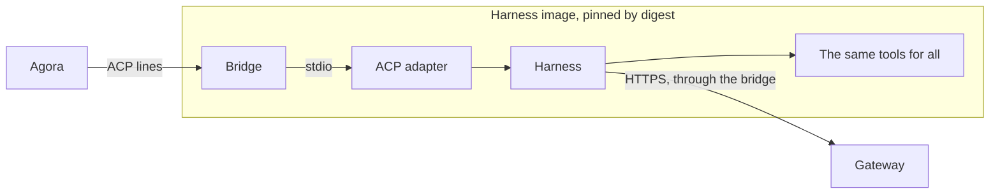

# ADR 000n — Harnesses

- **Status:** accepted
- **Date:** 2026-10-02

## Context

- Agora works with several harnesses — claude-code, codex, … — without depending on their CLIs,
  transcripts or file formats.
- It needs structured exchanges: prompts, streamed content, tool calls, plans, permissions,
  cancellation, configuration.
- A harness runs in a hostile sandbox, started in a warm pool before any execution exists.
- Whatever sits in the sandbox can be read, run or subverted by the agent.

## Decision

1. **ACP is the only protocol between Agora and a harness.** Each harness comes with its ACP
   adapter; Agora speaks ACP unchanged, with no protocol of its own on top.
2. **One image per harness:** the harness, its adapter, the bridge and the same tools for all,
   pinned by digest. No variant per right, persona or profile: rights are grants at the gateway.
3. **The image is trusted, the execution is not.** Nothing is installed at start, and nothing in
   the sandbox is relied on for security.
4. **The bridge is thin.** It starts the adapter and reports ready while it runs, checks Agora's
   token, pipes ACP lines between the adapter and a single connection, gives the adapter its only
   way out, and puts back or pushes the anchor. It numbers nothing, keeps no line and sends no
   ACP of its own; it reads the adapter only as fast as Agora takes the lines, and not at all
   while Agora is away.
5. **A harness declares, with its pool, the services it needs before any execution** — its base
   profiles. Agora treats every harness alike from there; whether the harness uses that way out
   to initialize in the pool is its own capability.

## Why

- **One interface over several harnesses.** ACP carries prompts, streamed content, tool calls,
  plans, permissions and cancellation with the same meaning for all. claude-code and codex both
  have an adapter (claude-agent-acp 0.64.2 and codex-acp 1.1.9 measured by the previous
  implementation, 2026-08-05; claude-agent-acp 0.75.1 on g4, 2026-09-29).
- **Rights live at the gateway, not in software.** A hostile process runs any binary it finds;
  an image without a tool restricts nothing. The same tools everywhere keep images and pools few.
- **Nothing to install at start.** The warm pool hands out a ready sandbox; installing would mean
  a way out to package registries and a cold start.
- **What differs between harnesses is declared, not coded.** A new harness comes as an image, a
  pool and its base profiles; Agora and the bridge do not change.
- **A thin bridge keeps the hostile zone small.** It is the only Agora code in the sandbox. What
  must last — history, positions, Sessions — lives in Agora, where it is durable; the bridge
  rarely changes, so images rarely change.
  Measured on g4 under Kata, 2026-09-30, with images from `7afc4d7`: unread output survived a
  10 s disconnection, 3,600 large chunks arrived in order, and Agora restarted without sending a
  second `initialize`. Local bridge tests drain 20,000 lines after an absent reader, exceeding
  the former replay ring.

## What we tried

| Option | Why not |
| --- | --- |
| Each harness through its native interface (CLI flags, SDK) | Each brings its own lifecycle, streaming, tool and permission semantics into Agora. |
| Driving a terminal or parsing transcripts | Text meant for a human does not carry tool state, plans, permissions or cancellation reliably. |
| An Agora protocol that normalizes ACP | A second protocol to translate forever, lagging ACP and dropping what it does not model. |
| Image variants per right, persona or profile | A missing binary restricts nothing, and variants multiply pools. |
| Installing tools at start | A way out to package registries, and a cold start. |
| A bridge with state of its own: it numbered the lines, kept the last 2,000 for replay, and sent `initialize` itself | History and ACP state in the hostile zone, bounded by its memory; both belong to Agora. |

## Consequences

- A harness without a stable ACP v1 adapter is not supported; the adapter is pinned with its
  harness.
- Adding or upgrading a tool rebuilds and tests every image.
- The pool's readiness, a harness initialized in the pool and a Session ready for a prompt are
  three separate facts; only the harness can turn a warm token into the second.
- The pool's readiness proves the adapter runs, not that it speaks ACP: Agora's `initialize`, on
  the first connection, is the first proof. codex refuses a second one, so Agora never resends it
  to the same process.
- A crash or a network drop between Agora and the bridge can lose the lines in flight; the log
  records the break.
