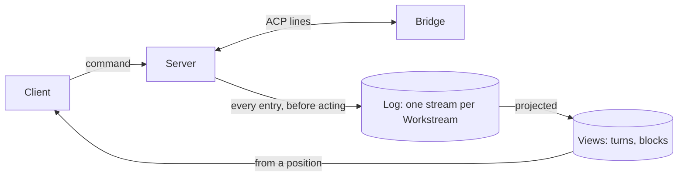

# ADR 000n — Log

- **Status:** proposed
- **Date:** 2026-09-29

## Context

- Work must be found again after the browser closes, Agora restarts or the sandbox disappears:
  the history cannot live in a process or a sandbox.
- ACP streams incremental updates; the client needs assembled turns, tools, plans and
  permissions. The two do not have the same shape.
- A harness's native files belong to the harness; Agora keeps them only as an opaque anchor.
- A connection to a sandbox can break at any time, Agora's own restarts included.
- Adapters behave differently when a second prompt arrives during a turn.

## Decision

1. **The log is Agora's, and only Agora's.** It holds the entries — every user command and every
   ACP line exchanged with a harness, in both directions, stored whole, as written. Neither the
   bridge nor the harness keeps a history Agora relies on.
2. **One ordered stream per Workstream.** Agora gives each entry its position when it writes it.
   A Session attributes entries to one ACP session in one execution; it is a filter on the
   stream, not a log of its own. Restoring from an anchor opens a new Session; changing the model
   does not.
3. **Written before acted on.** An outgoing line is written before it is sent; an incoming line
   before Agora handles it or shows it. A break with the bridge is written too.
4. **What the client shows is a projection** of the log: deterministic, versioned, rebuilt from
   the log. History is never edited.
5. **One turn at a time per Workstream.** A second prompt is refused while a turn is in progress.
6. **PostgreSQL** holds the log, the projections and the anchors.

## Why

- **Complete and faithful.** What today's views ignore stays available tomorrow; a wrong view is
  fixed by rebuilding it, never by editing history. PostgreSQL keeps `9007199254740993` exact
  when given the line's text (measured by the previous implementation, PostgreSQL 17,
  2026-07-29).
- **Crash-safe.** Nothing is sent or shown before it is written: after a restart, the log is
  exactly as far as anything went.
- **One history, in one place.** A sandbox can disappear, a bridge can restart: no history goes
  with them.
- **Honest attribution.** Every entry belongs to the Session it happened in; successive Sessions
  share one order. A model change is itself an ACP exchange, already in the log.
- **One turn at a time, because adapters disagree.** Measured by the previous implementation on
  four adapters (2026-08-09 and 10): none refuses a second prompt. codex-acp 1.1.14 never answers
  it and wedges the Session; claude-agent-acp 0.66.0 cuts the running turn short and still
  reports `end_turn`; OpenCode 1.18.16 and Pi 0.0.33 queue it. No response is a portable signal.
- **PostgreSQL makes positions, uniqueness and "written before sent" transactions**, for the
  log, the views and the anchors alike.

## What we tried

| Option | Why not |
| --- | --- |
| Intent, Observation and a reconciliation loop around the log | Built to converge a desired configuration; Agora no longer reconciles, Agent Sandbox owns the executions. |
| Storing only the views | Assembled messages cannot give the exchange back: unknown members and the order of updates are gone. |
| Storing the ACP SDK's parsed objects | Measured by the previous implementation (2026-07-29, SDK 1.3.0): unknown members are stripped and `9007199254740993` becomes `…992`. |
| Storing the transport bytes | Whitespace, member order and framing carry no ACP meaning. |
| One log per Session | Two copies to keep in the same order. |
| A new Session on every configuration change | The change is already an ACP exchange in the log. |
| Building the views when read | Every reader would reimplement ACP assembly. |
| Validating against ACP's root schema | Measured by the previous implementation (SDK 1.3.0): an unknown `session/update` type passes it. Lines are validated per method and direction. |

## Consequences

- Every entry is a database write before it moves on: latency and backpressure on every turn.
- Without PostgreSQL, sending stops.
- The log holds everything the agent says and does: it is product data, with access and
  retention to decide.
- A crash or a network drop can lose the lines in flight: the break is in the log, the view shows
  where, and a turn in progress stays uncertain until its end is seen.
- The claim keeps what drives the execution — deadline, turn start, stop, the session an anchor
  resumes; the log keeps what happened. After a restart, the claim says which turn was in
  progress and the log how far it went.
- Changing a projection bumps its version and rebuilds it.
- An invalid line is not an entry; only its size, digest and reason are kept.
- Agora never reads inside an anchor.
