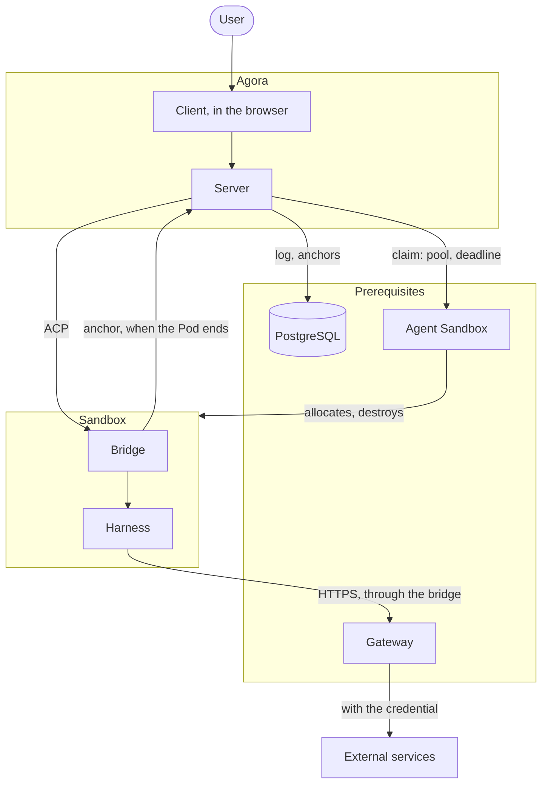
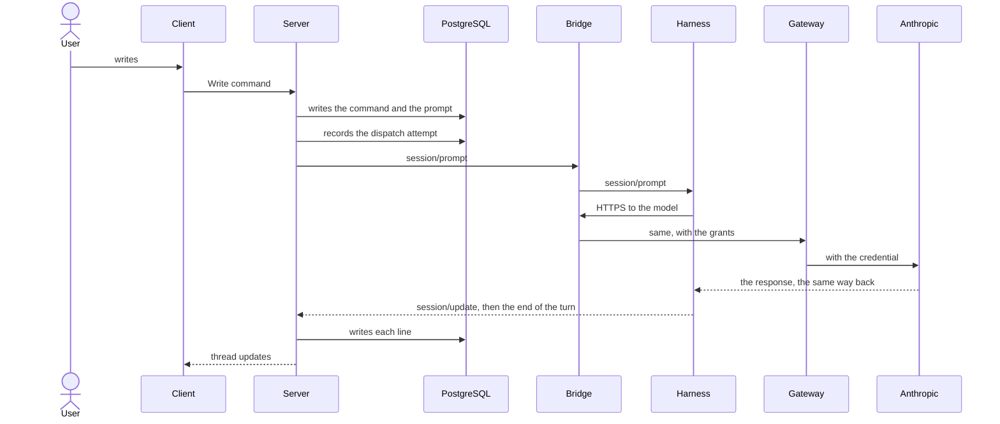

# Overview

The map of Agora: what it does, what it is made of, what it relies on, and where trust stops. It
stays at the components' boundaries; each subject's inside is explained in its own document
here.

## What Agora does

Agora lets you work with agents running in sandboxes, follow their exchanges and find your work
again after an interruption. It offers one interface over several harnesses, all spoken to in
ACP, and keeps the history independently of the lifetime of processes and infrastructure.

| Feature | Expected behaviour |
| --- | --- |
| Durable history | Find requests, responses, tools and errors again after the browser is closed or Agora restarts. |
| On-demand execution | Open an execution with a harness and a configuration chosen among the allowed options. |
| Interaction | Send a message, follow the outputs, answer ACP permissions and request cancellation of a turn. |
| Stop | Close admission of new messages and stop renewing the execution's deadline; it disappears when the infrastructure destroys it. |
| Reconnection | Find an execution that is still alive without creating a second context or resending the last message. |
| Resume after loss | Explain what is recoverable and allow an explicit continuation. |
| Harness choice | Use a common interface, without claiming that all harnesses have the same resume or configuration capabilities. |

Switching harness with context transfer, personas, customizable skills, conversation branches
and multi-user collaboration are outside the scope.

## The map

## The components

| Component | Role | Holds |
| --- | --- | --- |
| **Client** | Runs in the browser. Displays a Workstream's thread with assistant-ui and turns the user's actions into commands. | The thread it received, in memory. |
| **Server** | Records the commands and the ACP exchanges, projects them for the client. Obtains the executions, relays ACP, follows the turns, sets the deadlines, receives the anchors. Signs each execution's grants. | The log, the anchors, its signing keys, the database login. |
| **Bridge** | In front of the harness, in the sandbox's image, and thin. Starts the harness's adapter and reports ready while it runs, pipes ACP lines between the server and the harness, gives the harness its only way out, puts back or pushes the anchor. | The execution's grants, in memory. |
| **Harness** | A coding agent (claude-code, codex, …) behind its ACP adapter. | Its native files, in the sandbox only. |

The server has three parts, each with its own document: the log (`log.md`), the executions
(`executions.md`) and the credentials (`credentials.md`). The lab mounts these parts, with
PostgreSQL and one Workstream per execution, without the product client, and serves a page that
plays every case.

## The prerequisites

| Prerequisite | Provides | Decided in |
| --- | --- | --- |
| **Kubernetes** | Runs everything. Its API is how Agora requests executions and checks which Pod is calling. | — |
| **Agent Sandbox**, with Kata | Warm pools per harness image, one sandbox per claim, destruction at the deadline; each Pod in its own VM. | executions ADR |
| **The gateway** (agentgateway) | The sandboxes' only way out: checks the grants on every request and sets the services' credentials. | gateway ADR |
| **PostgreSQL** | Agora's storage: the log, its views and the anchors. | log ADR |

infra-k8s deploys them, with the harness images' pools and the network rules. Agora configures
them with allowed values and reimplements none of them: no Pod controller, no reaper, no
credential store. When a prerequisite fails, the operation that needs it fails visibly; Agora
does not repair it or converge towards a desired global state.

## Where trust stops

A sandbox is hostile: whatever runs in it may try anything its network and its tokens allow.
Each zone holds only what its role needs.

| Zone | Holds | Never holds |
| --- | --- | --- |
| The browser | The thread it displays. | A token for the sandboxes, a credential. |
| The server | The log, the anchors, the keys that sign its tokens and the grants, the database login. | The services' credentials. |
| A sandbox | The harness, its files, short-lived tokens that expire on their own. | A credential, a database login, a way out other than the gateway. |
| The gateway | The services' credentials, Agora's public key. | Agora's signing key: it checks grants, it cannot write them. |

## A message, end to end

On an execution already open:

The server writes the command and every ACP line to the log before acting on them: the client
only ever displays what the log holds. The model is reached like any other service,
through the bridge and the gateway.
