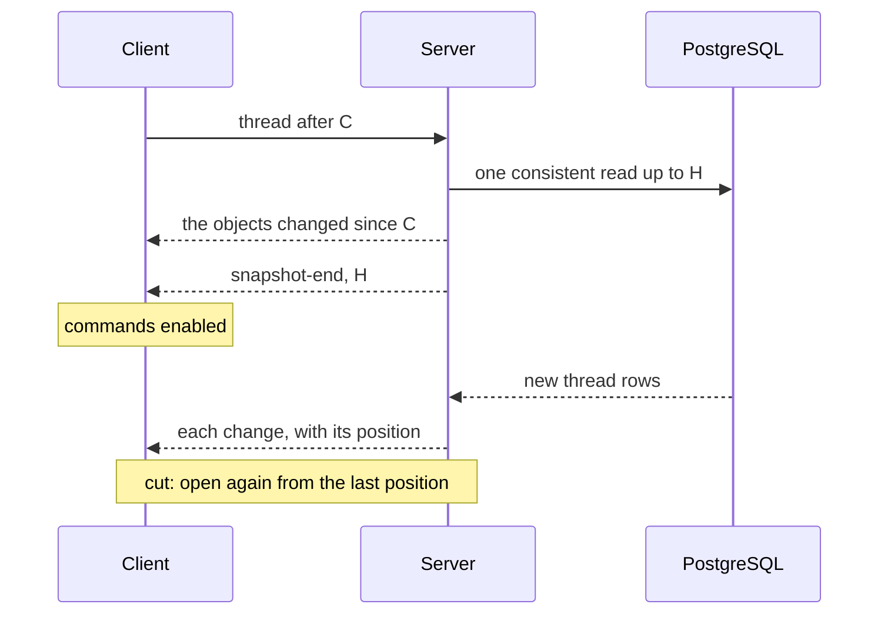
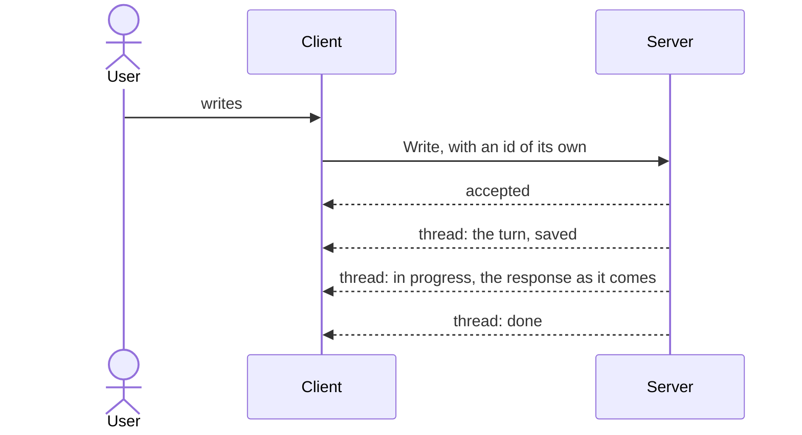
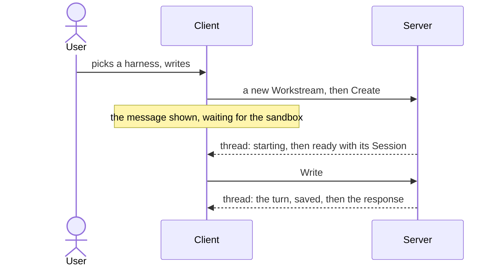

# The client

The client is a screen on Agora's log. It shows the Workstreams and the thread of the one open,
and turns what the user does into commands; it shows no state the log does not hold, but a first
message waiting for its sandbox. It runs in the browser, served by the server at
`agora.bretagne.dev`, behind the identity proxy.

## Who does what

| Actor | Role |
| --- | --- |
| The identity proxy | Pocket-ID in front of the server: only the operator gets through, and the server learns who. |
| The server | Serves the client and its API. Projects the log into objects — the Workstream view, turns, elements, notices — and appends each change to the Workstream's thread. Applies the commands. |
| The client | Reads a Workstream's thread from a cursor, keeps its objects, converts them into assistant-ui messages, and sends the commands. Keeps the objects and the cursor in the browser, together. |
| assistant-ui | Renders the messages, the composer and the list, and hands the user's actions back. |

## Reading a Workstream

The first read starts at zero and gets everything; a reload starts from the stored cursor and
gets only what changed. Each change replaces a whole object, so reading a change twice does no
harm, and a reset from the server starts over cleanly.

## Sending a message

The answer to a command only says whether it was taken; what it did appears in the thread, like
everything else. Sent twice after a network failure, with the same id, it runs once.

## Starting with a message

Nothing exists on the server before the first message: a new Workstream is a draft in the
browser. When no execution runs — none yet, or the last one failed or ended — sending starts one
first, and it continues the Workstream: the server restores the harness's last anchor and gives the
agent the exchanges it lacks as text. Before sending, the composer says when the agent will get
some of the conversation as text only. If the execution fails before its Session opens, the message
goes back to the composer.

## From objects to the screen

A turn becomes the user's message and the agent's response; the response's parts are the turn's
elements — text, reasoning, tools with their permissions, the plan — in the order the log holds
them. A notice becomes a line of its own between turns: a Session that starts or ends, a
connection lost, a request that failed, an execution that ends.

The Workstream view's state decides what the composer offers: writing when the execution is
ready and no turn holds it; a reason when it is not; and with no execution running, starting one
with the message. An uncertain turn keeps its note until the log proves how it ended; its banner
offers to cancel it or stop the execution, never to send it again.

The screen follows assistant-ui's base skin, with the first Agora's colours and mark. A
response's steps — reasoning, tools, the plan — are one line each, opened on demand; a permission
the agent waits for is a card under its tool, with the agent's own options.

## Open questions

- Long threads: everything is read at once.
- Several operators: who may read and write a Workstream.
- What the client does with the protocol lines it does not show, the model and the slash
  commands an agent offers.
