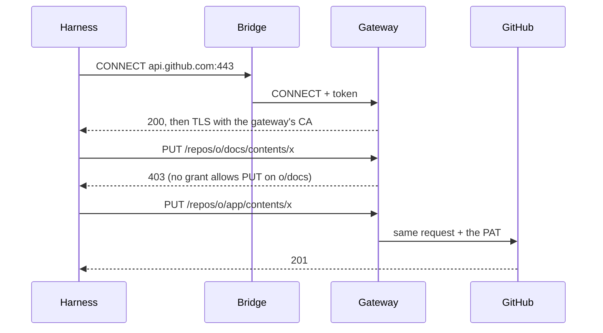

# Credentials

A harness needs credentials — Claude, GitHub — but its sandbox never holds one. Everything it
sends out goes through the gateway, which checks each request against the rights Agora gave the
execution, and sets the real credential on the way.

## Who does what

| Actor | Role |
| --- | --- |
| Agora | Turns the execution's profiles into grants, signs them into a token, hands the token to the bridge. It never sees a credential. |
| The bridge | Opens a local proxy for the harness and forwards each outbound connection to the gateway, with the token. |
| The gateway | A prerequisite (agentgateway). Holds the credentials, checks the token and the grants, sets the credential. |
| infra-k8s | Stores the credentials, deploys the gateway, lets sandboxes out only towards it. |

## Why a proxy in the bridge

The harness's adapter starts in the warm pool, before the execution exists: its environment
cannot carry a token, and passing one through the claim would force a cold start. So the bridge
starts the adapter with `HTTPS_PROXY` pointing at a local proxy of its own, which refuses
everything until Agora attaches a token, after the claim. Any harness that honours
`HTTPS_PROXY` benefits.

The token stays in the bridge's memory, neither in the adapter's environment nor on disk: the
agent can use the way out, not take the token with it, and the network lets it go nowhere else.

## Profiles and grants

A **profile** is a right expressed for humans: `anthropic`, `github:owner/repo:read`,
`github:owner/repo:write`. Agora compiles each profile into **grants**, which the gateway can
check on a request: a host, a pattern on the path, and the allowed methods.

| Profile | Grants |
| --- | --- |
| `anthropic` | `api.anthropic.com`, everything |
| `github:o/app:write` | `api.github.com` on `/repos/o/app…`, every method; `github.com` git fetch and push on `o/app` |
| `github:o/docs:read` | `api.github.com` on `/repos/o/docs…`, `GET` and `HEAD` only; `github.com` git fetch on `o/docs` |

Grants add up: any mix of profiles is just a longer list.

Grants are the only restriction, so they stop at what the gateway can check: a host, a path, a
method. An ACP permission, an installed tool or an instruction given to the model restricts
nothing on the service's side. If the gateway refuses or does not answer, the request fails;
nothing ever widens the grants.

## The token

The grants travel inside a short-lived JWT: a header, a content and a signature. The content is
plain JSON — the issuer, the audience, the execution, the expiry, and the list of grants. Agora
signs header and content with its Ed25519 private key.

The content is not encrypted: the sandbox can read its own rights. It cannot change them:
editing a grant or pushing back the expiry breaks the signature. The gateway checks the signature
with Agora's public key, then the expiry, the issuer and the audience; it needs nothing else to
decide.

## A request

The gateway applies a single rule to every request: some grant must cover its host, its path
and its method. The harness trusts the gateway's certificate authority, so the TLS it sees ends
at the gateway, which can read the request and set the credential.
