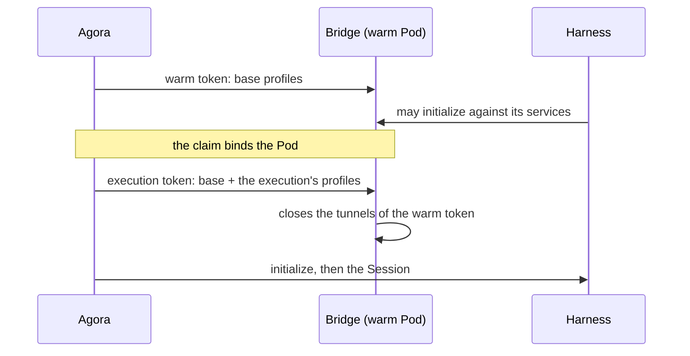
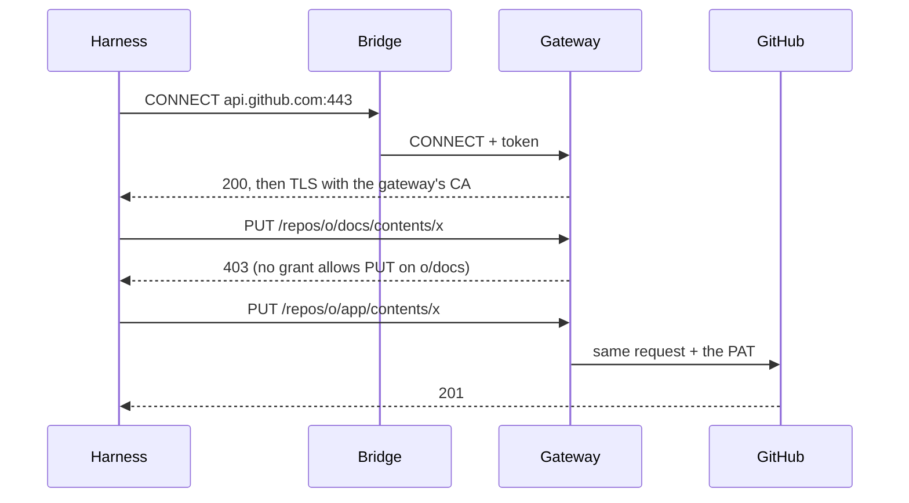
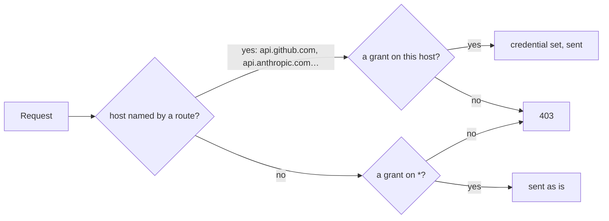

# Credentials

A harness needs credentials — Claude, z.ai, ChatGPT, GitHub — but its sandbox never holds one. Everything it
sends out goes through the gateway, which checks each request against the rights Agora gave the
execution, and sets the real credential on the way.

## Who does what

| Actor | Role |
| --- | --- |
| Agora | Turns profiles into grants, signs them into a token, hands the token to the bridge: in the pool, the pool's base profiles; for an execution, those and its own. It never sees a credential. |
| The bridge | Opens a local proxy for the harness and forwards each outbound connection to the gateway, with the token. |
| The gateway | A prerequisite (agentgateway). Holds the credentials, checks the token and the grants, sets the credential. |
| infra-k8s | Stores the credentials, deploys the gateway, lets sandboxes out only towards it, and declares each pool's base profiles. |

## Why a proxy in the bridge

The harness's adapter starts in the warm pool, before the execution exists: its environment
cannot carry a token, and passing one through the claim would force a cold start. So the bridge
starts the adapter with `HTTPS_PROXY` pointing at a local proxy of its own, which refuses
everything until Agora attaches a token. Any harness that honours `HTTPS_PROXY` benefits.

The token stays in the bridge's memory, neither in the adapter's environment nor on disk. That
does not hide it from the agent, which runs under the bridge's user and can read that memory.
What makes the token worthless elsewhere is its address: it names the Pod's, and the gateway
takes it from there only (below, "The token").

## Profiles and grants

A **profile** is a right expressed for humans: `anthropic`, `zai`, `chatgpt`, `internet`,
`github:owner/repo:read`, `github:owner/repo:write`. Agora compiles each profile into **grants**,
which the gateway can check on a request: a host, a pattern on the path, and the allowed methods.

| Profile | Grants |
| --- | --- |
| `anthropic` | `api.anthropic.com`, everything |
| `zai` | `api.z.ai`, everything |
| `chatgpt` | `chatgpt.com` on `/backend-api/codex…` and `/backend-api/wham…` |
| `internet` | `*`, everything: any host without a credential of its own |
| `github:o/app:write` | `api.github.com` on `/repos/o/app…`, every method; `github.com` git fetch and push on `o/app` |
| `github:o/docs:read` | `api.github.com` on `/repos/o/docs…`, `GET` and `HEAD` only; `github.com` git fetch on `o/docs` |

Grants add up: any mix of profiles is just a longer list.

Which repositories an execution may reach, and whether it may reach the Internet, is declared by
the operator — the **offered** profiles, each at its widest access — and picked by the user,
before the execution or between its turns.

Grants are the only restriction, so they stop at what the gateway can check: a host, a path, a
method. An ACP permission, an installed tool or an instruction given to the model restricts
nothing on the service's side. If the gateway refuses or does not answer, the request fails;
nothing ever widens the grants.

## From a warm Pod to an execution

A harness may need its services before anyone uses it: claude-code's SDK initializes against
Anthropic, and without a way out it retries for some twenty seconds. So the pool says which
services its harness needs from the start — its **base profiles**, `anthropic` for claude-code,
`zai` for opencode, `chatgpt` for codex, none for the mock — and Agora treats every pool alike.

| Moment | The bridge's token |
| --- | --- |
| In the pool | The pool's base profiles, naming the warm Pod. Renewed while the Pod waits. |
| At the claim, before `initialize` | The base profiles and the execution's own, naming the execution. |
| Between turns, when it would run out | The same rights in a new token. |
| Between turns, when the user changes its access | The base profiles and the new own ones, at once. |

Agora is the only one handing tokens over: once it sees the claim bound to the Pod, it stops
warming it, and the execution's token replaces the warm one. Each replacement closes the tunnels
opened with the previous token, so the new one is the only one in use: between turns, the harness
has nothing in flight to cut.

A warm token makes initializing in the pool possible; whether a harness does it is its own
capability. Without it, the execution's token arriving before `initialize` is already what keeps
the Session opening from stalling.

## The token

The grants travel inside a short-lived JWT: a header, a content and a signature. The content is
plain JSON — the issuer, the audience, the execution or the warm Pod, the expiry, and the list of
grants. Agora signs header and content with its Ed25519 private key.

The content is not encrypted: the sandbox can read its own rights. It cannot change them:
editing a grant or pushing back the expiry breaks the signature. The gateway checks the signature
with Agora's public key, then the expiry, the issuer and the audience; it needs nothing else to
decide.

The content also names the Pod's address, which Agora takes from Kubernetes, never from the Pod.
The gateway lets a request through only if it comes from that address. A Pod cannot send from
another's address, so a token carried out of its Pod opens nothing anywhere else. No secret could
play that part: anything the bridge keeps, the agent can read.

## A request

The gateway applies a single rule to every request: some grant must cover its host, its path
and its method. The harness trusts the gateway's certificate authority, so the TLS it sees ends
at the gateway, which can read the request and set the credential.

## The Internet

Every host the gateway holds a credential for has a route of its own. Any other host falls to one
more route, `internet`, which agentgateway picks last and which sets no credential. Its rule asks
for a grant on host `*`, which only the `internet` profile gives; the routes with a credential
compare the grant's host with the request's, which is never `*`. So the Internet adds the rest of
the Web and nothing more: an execution given `internet` and no `github` profile still cannot read
a repository, not even a public one — `github.com` is a route with a credential.

A route that takes any host could reach anything the gateway can, so the network bounds it: the
gateway goes out to public addresses only, on port 443. The operator's networks and the cluster
sit in private ranges it cannot reach, whatever name points there.

The Internet stays off unless picked. Credentials never leave the gateway, but what the agent
reads can steer it, and with the Internet it can send anything it holds anywhere — a repository
it was given included. Off by default, offered by the operator and picked per execution, it is a
choice made knowing that.
