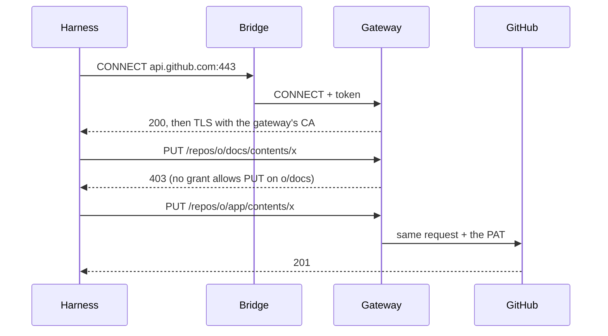

# Credentials

A harness needs credentials — Claude, GitHub — but its sandbox never holds one. Everything it
sends out goes through the gateway, which checks each request against the rights Agora gave the
execution, and sets the real credential on the way.

## Who does what

| Actor | Role |
| --- | --- |
| Agora | Derives the harness's base profiles and the execution's provisioned rights, signs their grants into a token and hands it to the bridge. Coordinates changes with turn admission. It never sees an upstream credential. |
| The bridge | Opens a local proxy for the harness and forwards each outbound connection to the gateway, with the token. |
| The gateway | A prerequisite (agentgateway). Holds the credentials, checks the token and the grants, sets the credential. |
| infra-k8s | Stores the credentials, deploys the gateway, lets sandboxes out only towards it. |

## Why a proxy in the bridge

The harness's adapter starts in the warm pool, before the execution exists. The image fixes its
tools and proxy address; Agora supplies its authorization separately. The bridge starts the
adapter with `HTTPS_PROXY` pointing at a local proxy of its own, which refuses everything until
Agora attaches a token. Any harness that honours `HTTPS_PROXY` benefits.

The token stays in the bridge's memory, neither in the adapter's environment nor on disk: the
agent can use the way out, not take the token with it, and the network lets it go nowhere else.

## From a warm Pod to an execution

The reviewed harness catalogue associates an image with its base profiles. A Claude Code Pod
needs the Anthropic route to preinitialize its SDK. Agora supplies a short-lived token for that
Pod with the base profiles, before any execution exists. The policy is associated with the
image; a signed token is issued dynamically, never baked into an image or template. Agora also
renews it while the Pod is waiting in the pool.

| Moment | Rights and identity |
| --- | --- |
| Warmup | The harness's base profiles only; identity of the unassigned Pod. |
| Claim assigned | Base profiles plus rights of resources actually provisioned and bound to the execution; identity of that execution. |
| Between turns | The complete authorized set is recalculated when resources, settings or the token's remaining lifetime require a change. |

Assignment ends warmup authorization management for that Pod. A delayed warmup renewal cannot
replace its execution token. Agora installs the execution's token and resets the old outbound
tunnels before admitting the first prompt. The claim continues to carry only pool and deadline;
it carries no token or execution configuration.

SDK preinitialization is a harness capability. A process prepared for a fresh Session can be
reused only with compatible settings; native restoration follows the harness's restore contract.
Pod readiness, a preinitialized SDK and a Session ready for a prompt are separate facts.

## Changes between turns

Each turn uses one confirmed configuration: grants, model and effort. A requested change during
a turn stays pending until its final answer has been committed. An uncertain turn keeps the
boundary closed. The server retains the requested and applied configurations independently;
the client reads their projected state.

The gateway obtains the JWT from the tunnel's CONNECT headers. Replacing the bridge's token
alone leaves old tunnels using old grants. At the boundary Agora installs the complete new
token, the bridge closes the old outbound connections, and new connections use the replacement.
The SDK process, ACP connection and Session continue. Model and effort changes use ACP, with
their applied values confirmed before the next prompt.

```mermaid
sequenceDiagram
    participant Agora
    participant Bridge
    participant Harness
    Note over Agora,Harness: Turn N uses configuration v1; a change is pending
    Harness-->>Agora: Final ACP response
    Agora->>Agora: Commit response; keep Write closed
    Agora->>Bridge: Install replacement JWT
    Bridge->>Bridge: Close old outbound tunnels
    Bridge-->>Agora: Rotation acknowledged
    Agora->>Harness: Apply model, then effort through ACP
    Harness-->>Agora: Confirm applied values
    Agora->>Agora: Record configuration v2; reopen Write
    Agora->>Harness: Next prompt through ACP
```

These stages have separate acknowledgements. If one fails or its outcome cannot be established,
the next prompt remains blocked; a partial application is not rolled back or called ready by
guessing. The token must cover the next turn's maximum duration with a margin, so renewal does
not require interrupting an admitted turn. Background tasks require a harness-specific policy:
a final ACP response alone does not prove that every network operation has ended.

## Profiles and grants

A **profile** is a right expressed for humans: `anthropic`, `github:owner/repo:read`,
`github:owner/repo:write`. Agora compiles each profile into **grants**, which the gateway can
check on a request: a host, a pattern on the path, and the allowed methods.

| Profile | Grants |
| --- | --- |
| `anthropic` | `api.anthropic.com`, everything |
| `github:o/app:write` | `api.github.com` on `/repos/o/app…`, every method; `github.com` git fetch and push on `o/app` |
| `github:o/docs:read` | `api.github.com` on `/repos/o/docs…`, `GET` and `HEAD` only; `github.com` git fetch on `o/docs` |

Grants add up: any mix of profiles is just a longer list.

Grants are the only restriction, so they stop at what the gateway can check: a host, a path, a
method. An ACP permission, an installed tool or an instruction given to the model restricts
nothing on the service's side. If the gateway refuses or does not answer, the request fails;
nothing ever widens the grants.

## The token

The grants travel inside a short-lived JWT: a header, a content and a signature. The content is
plain JSON — the issuer, the audience, the execution, the expiry, and the list of grants. Agora
signs header and content with its Ed25519 private key.

The content is not encrypted: the sandbox can read its own rights. It cannot change them:
editing a grant or pushing back the expiry breaks the signature. The gateway checks the signature
with Agora's public key, then the expiry, the issuer and the audience; it needs nothing else to
decide.

## A request



The gateway applies a single rule to every request: some grant must cover its host, its path
and its method. The harness trusts the gateway's certificate authority, so the TLS it sees ends
at the gateway, which can read the request and set the credential.
