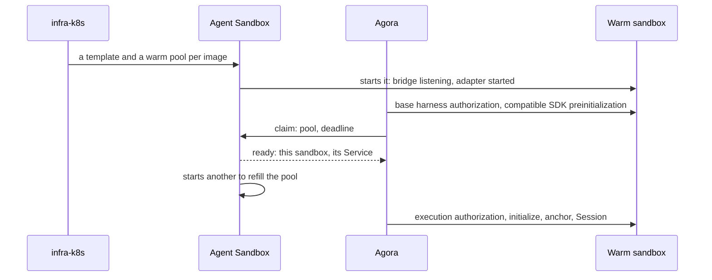
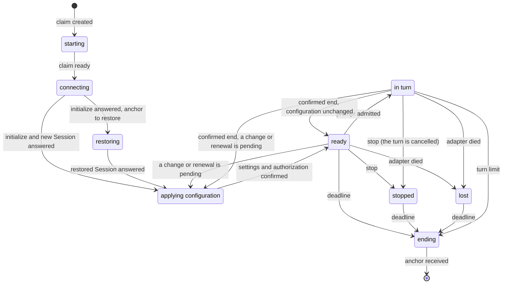

# Executions

An **execution** is a harness running in a sandbox obtained from Agent Sandbox. Agora creates no
sandbox: it requests one, talks ACP with the harness inside, sets the sandbox's deadline and
keeps its anchor when it ends.

## Who does what

| Actor | Role |
| --- | --- |
| infra-k8s | Declares a template and a warm pool per harness image, the Kata runtime, the network rules, the resources. |
| Agent Sandbox | Keeps the pools warm, hands out one sandbox per claim, destroys it at its deadline. |
| The image | A bridge in front of the harness's ACP adapter, both started in the pool, before any claim. |
| Agora | Requests the claims, moves their deadline, talks ACP with the harness through the bridge, stores the anchors. It never deletes anything. |

## Pools and claims

| Object | What it is | Declared by |
| --- | --- | --- |
| `SandboxTemplate` | The Pod of a harness: its image pinned by digest, the Kata runtime, the network rules. | infra-k8s |
| `SandboxWarmPool` | A number of sandboxes started from a template, waiting. One pool per image, named after its digest and labelled with its harness. | infra-k8s |
| `Sandbox` | One sandbox: a Pod and its Service. | Agent Sandbox, to fill a pool |
| `SandboxClaim` | A request: a sandbox from this pool, until this time. One per execution, with the execution's name. | Agora |

A claim carries only what Agent Sandbox reads: **the pool and the deadline**. Choosing the pool
is choosing the harness and the exact version of its image; Agora finds the pools by their
harness label.

Warming is the point. A warm sandbox has its Pod running, its bridge listening and its adapter
started, before any execution exists. A claim takes one, ready in a fraction of a second, and
Agent Sandbox starts another to refill the pool; when the pool is empty, one is created cold from
the template, in a few seconds. A used sandbox is never returned to the pool.

Agora can supply the reviewed harness base authorization while the Pod waits, allowing
compatible SDK preinitialization without a user prompt. Allocation, SDK preinitialization and a
configured ACP Session are separate readiness facts. The execution's settings and provisioned
resource rights are established after assignment.

So every sandbox of a pool is interchangeable, and must stay so: nothing specific to an execution
goes through the claim, or the sandbox would have to be created for it, cold. The anchor to
restore, execution-specific rights and the ACP session reach the sandbox through the bridge,
after the claim. Nor is the claim Agora's memory: what Agora must remember about an execution
is in its log.

## The life of an execution

Configuration application is a barrier, not a replacement of the SDK or Session. The next
prompt waits for its confirmation; only outbound tunnels reset during token replacement.
The spec lists the lifecycle states and configuration barrier, including *uncertain* (the end
of a turn could not be seen) and *error* (the claim will not succeed).

## The deadline

Agora never destroys a sandbox; it only moves its deadline, and Agent Sandbox destroys it when
the deadline passes.

| Moment | Deadline |
| --- | --- |
| Creation | now + 10 minutes (the lease) |
| During a turn, every minute | the earlier of now + 10 minutes and turn start + 1 hour |
| End of the turn | now + 10 minutes, then nothing until the next prompt |
| Stop | nothing: Agora stops renewing |

An idle execution therefore disappears one lease after its last turn, and a runaway turn after
one hour. The turn start that bounds it is in the log, so a restart of Agora keeps the limit.

## The end of the Pod and the anchor

When the deadline passes, Agent Sandbox deletes the claim and the Pod receives SIGTERM. Within
the 30-second grace period, the bridge stops the adapter, reads the harness's native files as a
whole — the anchor — and pushes them to Agora. It proves which Pod it is with the projected
ServiceAccount token Kubernetes gives it; Agora checks it with a TokenReview. The Pod's claim
names the execution, and the log gives the session the anchor will resume.

Restoring an anchor puts those files back into a new sandbox, through the bridge once the claim
is ready, and resumes the session there. It is a new session for the model: the whole context is
paid again.

## Reaching the harness

Agora reaches each bridge through the Sandbox's Service, with a short token it signs for that
Pod. The bridge pipes the adapter's ACP lines to a single connection at a time, and back; it
numbers nothing and keeps nothing. Agora is that connection: it sends `initialize` itself on its
first connection, writes every line to the log before acting on it, and tracks each turn from the
ACP traffic.
