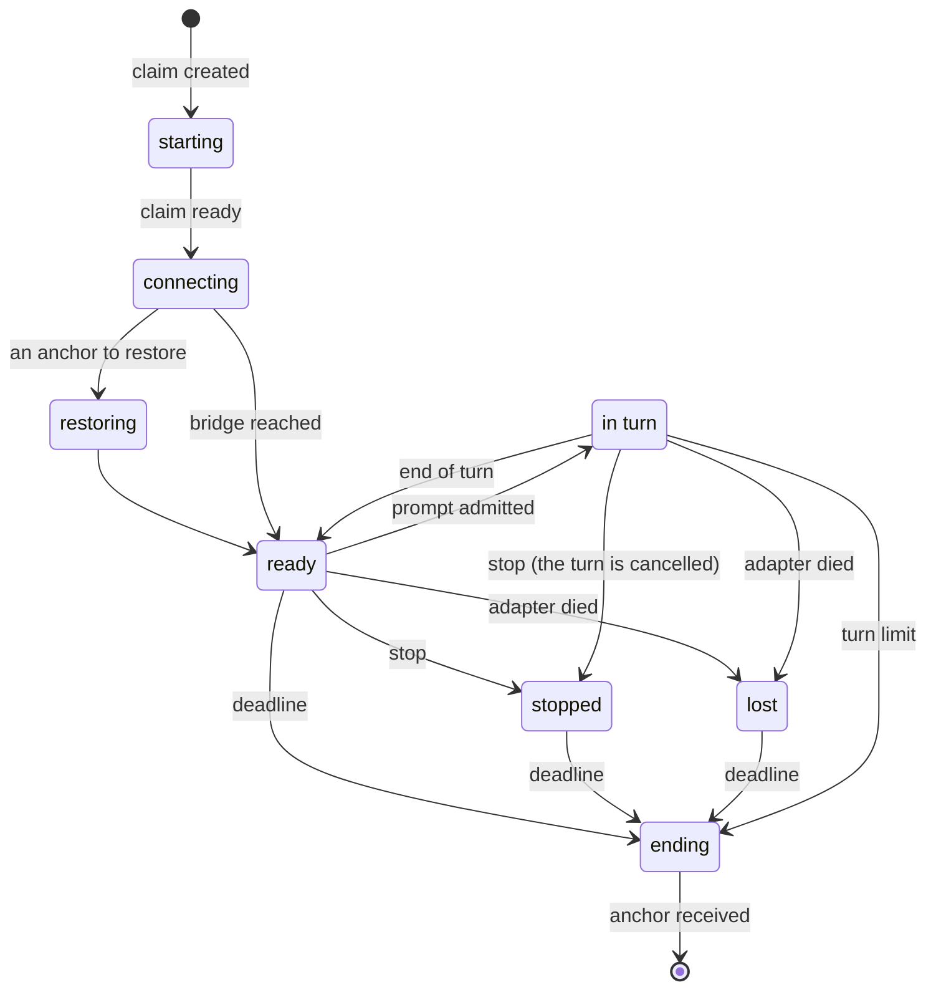

# Executions

An **execution** is a harness running in a sandbox obtained from Agent Sandbox. Agora creates no
sandbox: it requests one, talks ACP with the harness inside, sets the sandbox's deadline and
keeps its anchor when it ends.

## Who does what

| Actor | Role |
| --- | --- |
| Agent Sandbox | Keeps a warm pool of sandboxes per harness image, hands one out per claim, destroys it at its deadline. |
| The image | A bridge in front of the harness's ACP adapter, both started in the pool, before any claim. |
| Agora | Requests the claims, relays ACP while following turns, re-arms the deadline during a turn, stores the anchors. It never deletes anything. |
| infra-k8s | Templates and pools per image, the Kata runtime, the network rules, the resources. |

## The life of an execution

A sandbox taken from the pool is ready in a fraction of a second; when the pool is empty, one is
created cold in a few seconds. A used sandbox is never returned to the pool. The spec lists every
state, including *uncertain* (the end of a turn could not be seen) and *error* (the claim will
not succeed).

## The deadline

Agora never destroys a sandbox; it only moves its deadline, and Agent Sandbox destroys it when
the deadline passes.

| Moment | Deadline |
| --- | --- |
| Creation | now + 10 minutes (the lease) |
| During a turn, every minute | the earlier of now + 10 minutes and turn start + 1 hour |
| End of the turn | now + 10 minutes, then nothing until the next prompt |
| Stop | nothing: Agora stops renewing |

An idle execution therefore disappears one lease after its last turn, and a runaway turn after
one hour. Agora writes what it must remember — the turn in progress, the session, a stop — on
the claim itself, so a restart of Agora finds everything again.

## The end of the Pod and the anchor

When the deadline passes, Agent Sandbox deletes the claim and the Pod receives SIGTERM. Within
the 30-second grace period, the bridge stops the adapter, reads the harness's native files as a
whole — the anchor — and pushes them to Agora. It proves which Pod it is with the projected
ServiceAccount token Kubernetes gives it; Agora checks it with a TokenReview.

Restoring an anchor puts those files back into a new sandbox and resumes the session there. It
is a new session for the model: the whole context is paid again.

## Reaching the harness

Agora reaches each bridge through the Sandbox's Service, with a short token it signs for that
Pod. The bridge relays the adapter's ACP lines one by one, numbered, to a single client at a
time, and keeps the recent ones so a reconnection can replay what it missed. Agora is that
client; it relays in turn to its own consumers and tracks each turn from the ACP traffic.
