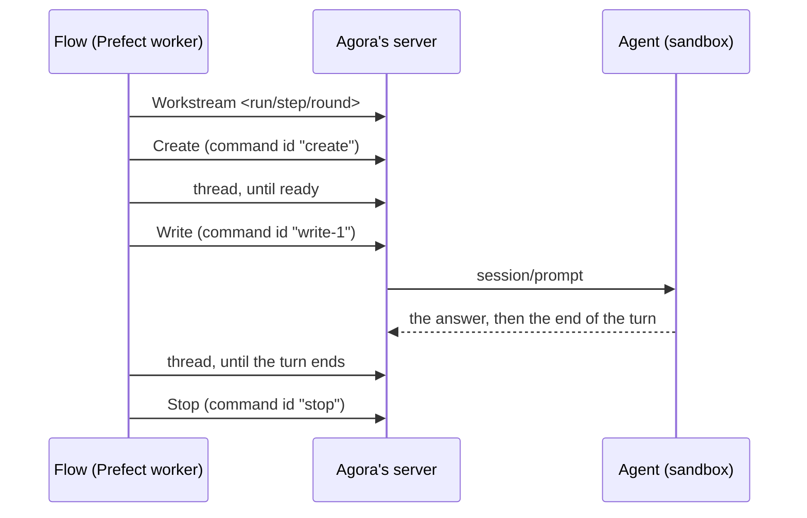

# Flows

A flow chains agents: an architect, then a human's approval, then a developer and a reviewer until
the review approves. Prefect runs the flow; each step is an ordinary Workstream of Agora, which a
person can open, follow and take over in the client like any other.

## Who does what

| Actor | Role | Holds |
| --- | --- | --- |
| Prefect's server | Keeps the flows, their runs and states, the inputs a suspended run waits for; serves its UI at prefect.bretagne.dev, behind the identity proxy. | Its own database. |
| Prefect's worker | Polls the work pool `agora`, clones the agora repository at the deployment's branch, runs the flow as a process of its own Pod. | The runs' results, on local storage. |
| The flow (`apps/flows`) | Decides the steps, what each prompt says, what comes after an answer, when to ask a human. | Nothing between runs. |
| Agora | Runs each step's agent in a sandbox and keeps its Workstream: commands, ACP lines, the answer. | The record of every step. |
| The repository | Carries the work from one step to the next: the architect pushes the design to the work's branch, the developer the code, the reviewer reads it. | The work itself. |

An agent never receives a credential from the flow: it goes out through Agora's gateway with the
profiles its step's Create names — write on the repository for the architect and the developer,
read for the reviewer. Prefect holds no model key; its worker reaches Agora's server inside the
cluster, without the identity proxy, and names the Workstreams' owner itself. The network policy
admitting only that worker is what bounds this access.

## A step, end to end

The Workstream's id and every command id are derived from the step's identity — the run, the
step, the round — not drawn at random. Agora answers a command id it already accepted with its
first answer and writes nothing. So when Prefect runs a step again — a retry, a run resumed after
an approval, a worker restarted in the middle of a turn — the step finds its Workstream where it
is: it creates nothing, writes nothing again, and waits for the turn already running or reads the
answer already given. Only a new round gets new ids, and so a new agent.

## When a human decides

| Moment | How |
| --- | --- |
| The architecture | The run suspends with a form: the design's summary and its branch; approve, or refuse, with notes for the developer. |
| A review without its verdict | The run suspends with the answer in the form; approve or ask for another round. |
| What a step cannot settle | An uncertain turn, an execution gone, a refusal it does not know: the run suspends; retry once settled in Agora, or abort. |
| A permission the agent asks | Answered in Agora's client, in the step's Workstream; the step waits for its turn meanwhile. |

A suspended run holds no process: Prefect runs it again when it is resumed, and its completed
steps answer from their persisted results, or find their Workstreams again.

## What survives what

| Lost | What happens |
| --- | --- |
| The worker's Pod, during a turn | The turn goes on in its sandbox. The run, retried, finds the step's Workstream and waits for the same turn. |
| The worker's local storage | Completed steps run again and find their Workstreams: nothing is sent twice. |
| Prefect's database | The runs' history and their pending approvals. Every step's Workstream stays in Agora. |
| A step's execution | Agora's log says so; the step escalates to a human. |
