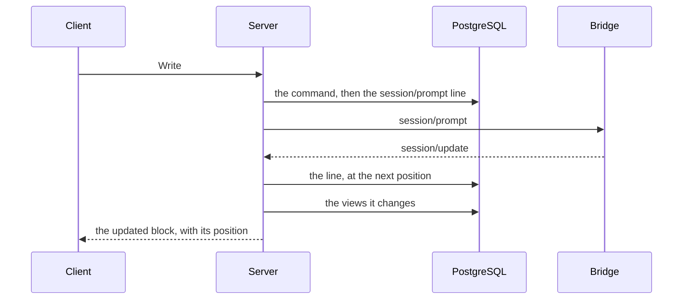

# The log

The log is Agora's record of what happened: every user command and every ACP line exchanged with
a harness, in one ordered stream per Workstream. Everything the client shows is a view of it.
Nothing else keeps history: not the bridge, not the sandbox. What follows describes the intended
behaviour; the open questions close the document.

## Who does what

| Actor | Role |
| --- | --- |
| The server | Writes each entry to the log before acting on it, projects the log into views, serves them to the client. |
| PostgreSQL | Holds the log, the views and the anchors. |
| The bridge | Pipes ACP lines between the adapter and the server. It keeps nothing. |
| The client | Reads a Workstream's views from its last position and sends commands. |

## Workstreams and Sessions

- A **Workstream** groups a piece of work and its ordered history: one stream, where each entry
  has its position.
- A **Session** attributes entries to one ACP session in one execution. It is a filter on the
  stream, not a log of its own.

Restoring from an anchor opens a new Session: it is a new context for the model. Changing the
model does not: the `session/set_config_option` exchange is itself in the log. Reconnecting to
the same live context keeps the Session; a sandbox's stable name is not enough to prove
continuity.

The requested configuration and the one actually applied stay distinct: the applied one is what
the harness answered, in the log.

## Handling a message

1. Authorize the user on the Workstream and deduplicate their request.
2. Check the target Session, the connection to the bridge and the turn in progress.
3. Write the command, then the `session/prompt` line, before sending it.
4. Write each line received, then follow the turn and update the views.

A line is stored whole, as the harness wrote it: members no view knows yet, large integers and
order included. A line that is not valid ACP for its method and direction is not an entry; only
its size, digest and reason are kept.

The usual path does not re-read Kubernetes, the grants or the native transcript before each
message. An open connection is not proof of progress: a timeout makes the stall visible; it
proves neither that the command failed nor that it had no effect.

## Views

The views are projections of the log: turns, text, reasoning, tools, plans, permissions and
notices, as the client displays them. They are built by reading the stream in order, and their
identities derive from the log, so rebuilding a view gives back the same identities. A view has a
version: changing how it is built rebuilds it from the log, which never changes. A line no view
understands stays in the log and shows as a generic item.

The client reads a Workstream's views from a position: opening, reloading and reconnecting are
the same action, with nothing lost and nothing received twice.

## Breaks

When the connection to the bridge breaks, because Agora restarts or the network drops, the bridge
stops reading the adapter until the server connects again: the adapter waits, and nothing is kept
in between. The lines in flight at the moment of the break may be lost. The server writes the
break into the log; the view shows where output may be missing, and a turn whose end was not seen
stays uncertain.

## Commands and recovery

A single turn at a time per Workstream: a Write is refused while a turn is in progress, because
adapters disagree on a second prompt. Configuration changes, sends and stops share an explicit
ordering rule. Cancellation can interrupt the active turn; a late cancellation must not hit the
next one.

After a crash, Agora finds the unresolved commands and their targets again. A retried
sandbox request must find the same resource when its creation succeeded despite
the lost response.

For ACP, "saved", "possibly sent" and "done" are distinct. A lost response does
not trigger an automatic resend. Agora looks for proof from the same context if the
harness allows it, otherwise it exposes the uncertainty. An Agora command id does
not guarantee deduplication on the harness side.

This targeted recovery is necessary. It does not bring back a loop that constantly
re-evaluates every dependency and the whole desired configuration.

## Stop and cleanup

Agora closes new sends, requests cancellation if needed, then stops renewing the deadline:
Agent Sandbox destroys the sandbox at most one lease later, and the execution's token expires on
its own. A stop is written on the claim, so it survives an Agora restart; saving the context
never delays it.

Expiry and the infrastructure-side reaper also clean up resources Agora has lost
track of. They do not replace the handling of an explicit stop request, and do not
guarantee instant termination.

Before a replacement is allowed, it must be decided which proof prevents the old
execution from continuing to modify files or call services. A resource missing from
the API is not enough in case of a network partition. If the infrastructure does not
provide this guarantee, the replacement stays blocked or a weaker guarantee must be
explicitly accepted. Agora will not build its own fencing system.

## Continuity of work

Three kinds of data have different guarantees:

| Data | Proposed guarantee |
| --- | --- |
| Product history | Durable once accepted by Agora. |
| Harness native context | Resumable only if the integration demonstrates it. |
| Files and artefacts | Not kept by Agora: the sandbox has no persistent storage, and the agent pushes what must last (code, a note). |

The anchor keeps the harness's native files when a Pod ends (`executions.md`); restoring it
opens a new Session. If reliable native resume is not available, Agora keeps the history and
explicitly offers a new context with the chosen elements. It does not present this operation as
an exact restore.

Internal compaction belongs to the harness. Agora does not try to prove after each
message that the model still has the whole history.

## Visible failures

| Incident | Expected reaction |
| --- | --- |
| Browser disconnected | The execution can continue; the interface re-reads the history on return. |
| Agora restarts | Find the target and the commands again; no blind resend. |
| Connection to the bridge breaks | Reconnection; the break is in the log, and a turn whose end was not seen stays uncertain. |
| Harness or sandbox lost | History kept; resume according to the data actually available. |
| The gateway refuses or does not respond | Error on the operation, with no automatic escalation of grants. |
| Log storage unavailable | Suspend new sends and apply bounded backpressure; do not claim durability that is not there. |
| Old execution cannot be stopped | Cleanup left to the infrastructure; no replacement announced as safe without proof. |

## Open questions

1. The functional scope.
2. Workspace storage and the resume actually promised for each harness.
3. Command ordering, recovery of uncertain sends and the buffering limits when the log is
   unavailable.
4. User access, ACP permissions and data retention.
