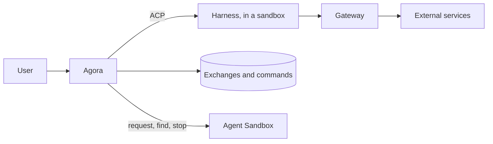

# Overview

Agora as a whole: what it is for, what it relies on, who owns what, and how it behaves. The
foundations are decided in the ADRs; the rest describes the intended behaviour, still to be
validated where marked, and the open questions close the document.

## Purpose

Agora lets you work with agents running in sandboxes, follow their exchanges and
find your work again after an interruption.

The product provides a common interface to several harnesses through ACP. It keeps
the history independently of the lifetime of processes and infrastructure.

## Foundations

| Foundation | Decided in |
| --- | --- |
| **Agent Sandbox**, a prerequisite, runs the executions on Kubernetes; Agora only sets their deadline, the infrastructure alone destroys them. | executions ADR |
| **A gateway** (agentgateway), a prerequisite, is the executions' only way out; Agora signs each execution's grants, the gateway checks them on every request and sets the credentials. | gateway ADR |
| **assistant-ui** renders the interface, as a view of Agora's log. | interface ADR |
| **ACP** is the interface between Agora and the harnesses. | — |

Cleaning up abandoned sandboxes is Agent Sandbox's job, not Agora's: no reaper in Agora. A
gateway outage or an access refusal can make an operation fail; Agora does not repair this
dependency automatically to pursue a global convergence.

## Features

| Feature | Expected behaviour |
| --- | --- |
| Durable history | Find requests, responses, tools and errors again after the browser is closed or Agora restarts. |
| On-demand execution | Open an execution with a harness and a configuration chosen among the allowed options. |
| Interaction | Send a message, follow the outputs, answer ACP permissions and request cancellation of a turn. |
| Stop | Close admission of new messages and stop renewing the execution's deadline; it disappears when the infrastructure destroys it. |
| Reconnection | Find an execution that is still alive without creating a second context or resending the last message. |
| Resume after loss | Explain what is recoverable and allow an explicit continuation. |
| Harness choice | Use a common interface, without claiming that all harnesses have the same resume or configuration capabilities. |

Switching harness with context transfer, personas, customizable skills,
conversation branches and multi-user collaboration are outside the scope. They are not
inherited from previous versions.

## Responsibilities

Agora owns the user's commands, their attribution, the log and the displayed
views. Agent Sandbox owns the execution resources. The gateway owns the
credentials and enforces the grants Agora signed for each execution.

Agora configures these integrations with allowed values. It does not reimplement a Pod
controller, a credential store, a gateway or their global monitoring.

Executions and credentials are explained in their own documents here; every subject's
contract is in `specs/` and its decisions in `adr/`.

## History and execution

Proposal: keep two simple product concepts.

- A **Workstream** groups a piece of work and its ordered history.
- A **Session** attributes exchanges to a concrete execution of a harness.

Reconnecting to the same live context keeps this attribution. A new process or
context must be identified explicitly; a sandbox's stable name is not enough to
prove continuity.

The requested configuration and the one actually applied stay distinct. This
requires neither a full Intent object on every change nor a generic reconciliation
engine. The exact boundary of Sessions when the model changes is still to be
decided.

The log keeps the complete accepted ACP exchanges, including their metadata.
Assembled messages and tool states are views that can be rebuilt. Infrastructure
credentials are not conversation data.

PostgreSQL is proposed for this transactional storage; no previous schema is
reused by default.

## Handling a message

1. Authorize the user on the Workstream and deduplicate their request.
2. Check the target Session, the ACP connection and incompatible commands in progress.
3. Durably record the command before sending it.
4. Send on the existing connection; log the exchanges received and feed the interface.

The usual path does not re-read Kubernetes, the grants and the native transcript before
each message. Connection events and operation responses update what Agora knows of
its interaction with the harness.

An open connection is not proof of progress. A timeout makes the stall visible; it
proves neither that the command failed nor that it had no effect.

## Commands and Agora's recovery

Proposal: a single active turn per Workstream. Configuration changes, sends and
stops share an explicit ordering rule. Cancellation can interrupt the active turn;
a late cancellation must not hit the next one.

After a crash, Agora finds the unresolved commands and their targets again. A retried
sandbox request must find the same resource when its creation succeeded despite
the lost response.

For ACP, "saved", "possibly sent" and "done" are distinct. A lost response does
not trigger an automatic resend. Agora looks for proof from the same context if the
harness allows it, otherwise it exposes the uncertainty. An Agora command id does
not guarantee deduplication on the harness side.

This targeted recovery is necessary. It does not bring back a loop that constantly
re-evaluates every dependency and the whole desired configuration.

## Credentials and isolation

The sandbox only receives a short-lived token, signed by Agora, that lists its grants; the
services' credentials stay in the gateway (`credentials.md`).

Restrictions must match what the gateway and the target service can actually enforce: a host,
a path, a method. An ACP permission, an installed tool or an instruction given to the model is
not a restriction on access to the service. A gateway outage makes the operation fail; it never
widens the grants.

## Stop and cleanup

Agora closes new sends, requests cancellation if needed, then stops renewing the deadline:
Agent Sandbox destroys the sandbox at most one lease later, and the execution's token expires on
its own. A stop is written on the claim, so it survives an Agora restart; saving the context
never delays it.

Expiry and the infrastructure-side reaper also clean up resources Agora has lost
track of. They do not replace the handling of an explicit stop request, and do not
guarantee instant termination.

Before a replacement is allowed, it must be decided which proof prevents the old
execution from continuing to modify files or call services. A resource missing from
the API is not enough in case of a network partition. If the infrastructure does not
provide this guarantee, the replacement stays blocked or a weaker guarantee must be
explicitly accepted. Agora will not build its own fencing system.

## Continuity of work

Three kinds of data have different guarantees:

| Data | Proposed guarantee |
| --- | --- |
| Product history | Durable once accepted by Agora. |
| Harness native context | Resumable only if the integration demonstrates it. |
| Files and artefacts | Not kept by Agora: the sandbox has no persistent storage, and the agent pushes what must last (code, a note). |

The anchor keeps the harness's native files when a Pod ends (`executions.md`); restoring it
opens a new session. The earlier Save and Handoff mechanisms are not adopted. If reliable
native resume is not available, Agora keeps the history and explicitly offers a new context
with the chosen elements. It does not present this operation as an exact restore.

Internal compaction belongs to the harness. Agora does not try to prove after each
message that the model still has the whole history.

## Visible failures

| Incident | Expected reaction |
| --- | --- |
| Browser disconnected | The execution can continue; the interface re-reads the history on return. |
| Agora restarts | Find the target and the commands again; no blind resend. |
| ACP disconnects during a turn | Targeted reconnection; result uncertain until it is established. |
| Harness or sandbox lost | History kept; resume according to the data actually available. |
| The gateway refuses or does not respond | Error on the operation, with no automatic escalation of grants. |
| Log storage unavailable | Suspend new sends and apply bounded backpressure; do not claim durability that is not there. |
| Old execution cannot be stopped | Cleanup left to the infrastructure; no replacement announced as safe without proof. |

## Open questions

1. The functional scope and the definition of Sessions.
2. Workspace storage and the resume actually promised for each harness.
3. Credentials: token renewal, and the TLS trust of git and codex.
4. Command ordering, recovery of uncertain sends and the buffering limits when the log is
   unavailable.
5. User access, ACP permissions and data retention.

## Validation and reuse

A slice is validated end to end: opening a sandbox, a logged ACP exchange, reloading the
interface, restarting Agora during a turn, stop then cleanup, a gateway refusal and a harness
loss for the visible errors.

Each piece of old code brought back must name the feature it serves, its dependencies
and the scenarios that validate it. The log, the ACP transport, the projections,
the interface and the harness integrations are candidates, not givens.

The previous implementation's reconciliation engines, infrastructure controllers and grant
models impose no obligation on Agora's design.
